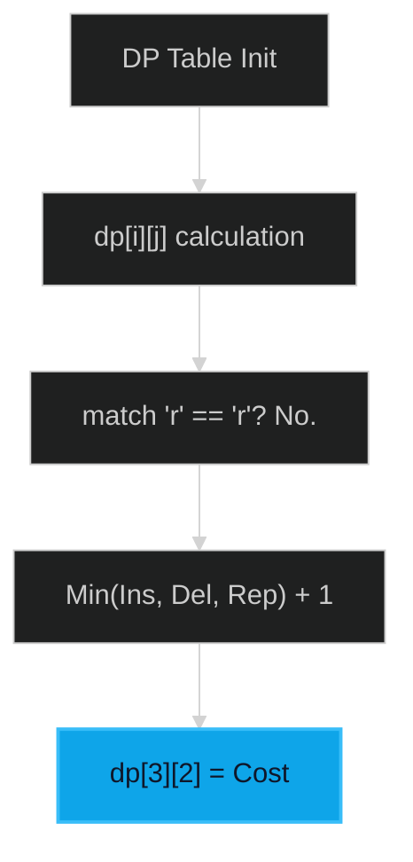

# Levenshtein Distance / Edit Distance 🔴 Hard

**Tags**: `Dynamic Programming`, `String`

## Prerequisite Topics

| Topic | Difficulty | Relevance | Notes |
|-------|-----------|-----------|-------|
| Dynamic Programming (2D) | 🔴 Hard | **Critical** | Building solution from subproblems |

## The Challenge

Given two strings `word1` and `word2`, return the *minimum number of operations* required to convert `word1` to `word2`.

### Strategic Analysis & Real-World Context

> [!NOTE]
> **Why this matters**: This is the core algorithm behind spell checkers, DNA sequence alignment, and diff tools (like `git`).

| Scenario | Preferred Approach | Why? |
|----------|--------------------|------|
| **General Case** | **Dynamic Programming** | Guarantees minimum operations in $O(M \times N)$. |
| **Space Constraint** | **DP with Row Optimization** | Reduces space from $O(M \times N)$ to $O(min(M,N))$ by keeping only previous row. |
| **Real-Time Search** | **Trie / BK-Tree** | For fuzzy search against millions of words, standard DP is too slow. |

**Constraints**:
- $0 \leq word1.length, word2.length \leq 500$
- `word1` and `word2` consist of lowercase English letters.

**Example**:
```python
Input: word1 = "horse", word2 = "ros"
Output: 3
Explanation: 
horse -> rorse (replace 'h' with 'r')
rorse -> rose (remove 'r')
rose -> ros (remove 'e')
```

## Algorithmic Analysis

### Naive Approach (Recursion)
Try 3 operations at every step.
- **Complexity**: $O(3^N)$.
- **Fail**: Redundant calculations (overlapping subproblems).

### Optimal Approach (2D DP)
Use a table `dp[i][j]` representing min cost to convert `word1[0...i]` to `word2[0...j]`.
- **Transitions**:
    - If `w1[i] == w2[j]`: `dp[i][j] = dp[i-1][j-1]` (No op).
    - Else: `1 + min(Insert, Delete, Replace)`
        - **Insert**: `dp[i][j-1]` (convert to w2[j-1], then append char)
        - **Delete**: `dp[i-1][j]` (delete w1[i], then convert rest)
        - **Replace**: `dp[i-1][j-1]` (swap char)

## Complexity Analysis

| Dimension | Complexity | Justification |
|-----------|-----------|---------------|
| Time | $O(M \times N)$ | Fill table of size $M \times N$. |
| Space | $O(M \times N)$ | Table storage. Can be optimized to $O(min(M,N))$. |

## Visual Walkthrough

Transform "hor" to "ro".


*(Simplified due to table complexity)*

## Solution

```python
def min_distance(self, word1: str, word2: str) -> int:
    m, n = len(word1), len(word2)
    dp = [[0] * (n + 1) for _ in range(m + 1)]
    
    for i in range(m + 1): dp[i][0] = i
    for j in range(n + 1): dp[0][j] = j
        
    for i in range(1, m + 1):
        for j in range(1, n + 1):
            if word1[i - 1] == word2[j - 1]:
                dp[i][j] = dp[i - 1][j - 1]
            else:
                dp[i][j] = 1 + min(dp[i][j - 1], dp[i - 1][j], dp[i - 1][j - 1])
                
    return dp[m][n]
```
