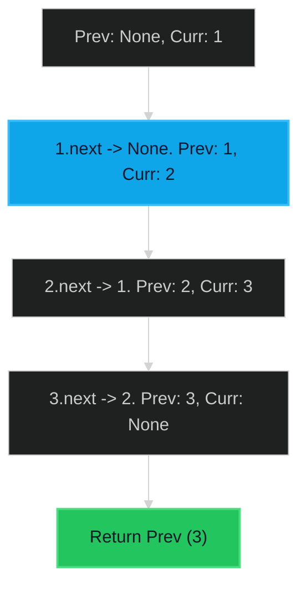

# Reverse Linked List 🟢 Easy

**Tags**: `Linked List`, `Recursion`

## Prerequisite Topics

| Topic | Difficulty | Relevance | Notes |
|-------|-----------|-----------|-------|
| Pointer Manipulation | 🟢 Easy | **Critical** | Safely rewiring next pointers |

## The Challenge

Given the head of a singly linked list, reverse the list, and return the reversed list.

### Strategic Analysis & Real-World Context

> [!NOTE]
> **Why this matters**: A fundamental operation in data structure manipulation, often a subroutine in complex problems (e.g., Palindrome Check, Add Numbers).

| Scenario | Preferred Approach | Why? |
|----------|--------------------|------|
| **Standard** | **Iterative** | $O(N)$ Time and $O(1)$ Space. Robust and simple. |
| **Functional/Immutable** | **Recursive** | Fits functional paradigms but risks Stack Overflow on large lists ($N > 1000$ in Python). |
| **Memory Constrained** | **Iterative** | Avoids recursion stack overhead. |

**Constraints**:
- Number of nodes in range $[0, 5000]$.
- $-5000 \leq Node.val \leq 5000$

**Example**:
```python
Input: head = [1,2,3,4,5]
Output: [5,4,3,2,1]
```

## Algorithmic Analysis

### Naive Approach
Copy values to array, reverse array, create new list.
- **Space**: $O(N)$.

### Optimal Approach (Iterative)
Three pointers: `prev`, `curr`, `next_node`.
- **Logic**:
    1. Save `next_node = curr.next`.
    2. Reverse link: `curr.next = prev`.
    3. Shift: `prev = curr`, `curr = next_node`.

## Complexity Analysis

| Dimension | Complexity | Justification |
|-----------|-----------|---------------|
| Time | $O(N)$ | Single pass. |
| Space | $O(1)$ | Constant extra variables. |

## Visual Walkthrough

Input: `1 -> 2 -> 3`



## Solution

```python
def reverse_list(self, head: ListNode | None) -> ListNode | None:
    prev = None
    curr = head
    while curr:
        next_node = curr.next
        curr.next = prev
        prev = curr
        curr = next_node
    return prev
```
