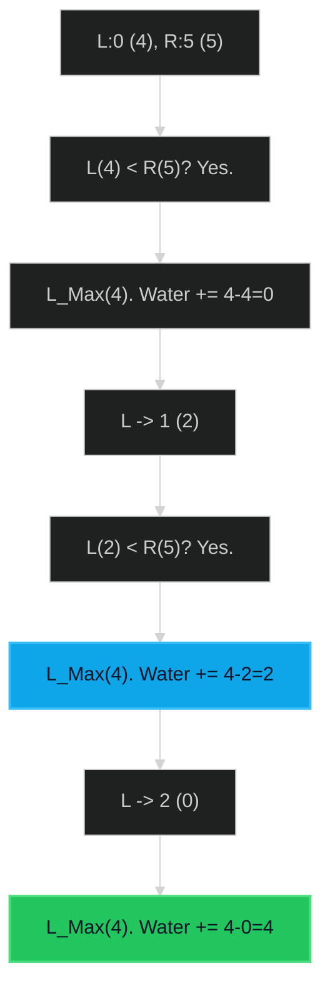

# Trapping Rain Water 🔴 Hard

**Tags**: `Array`, `Two Pointers`, `Stack`, `Dynamic Programming`

## Prerequisite Topics

| Topic | Difficulty | Relevance | Notes |
|-------|-----------|-----------|-------|
| Two Pointers | 🟡 Medium | **Critical** | Moving inward based on height |

## The Challenge

Given `n` non-negative integers representing an elevation map where the width of each bar is 1, compute how much water it can trap after raining.

### Strategic Analysis & Real-World Context

> [!NOTE]
> **Why this matters**: Key problem for understanding "Pre-computation" vs "Two Pointers" trade-offs. Applications in terrain analysis and histograms.

| Scenario | Preferred Approach | Why? |
|----------|--------------------|------|
| **Standard** | **Two Pointers** | $O(N)$ Time, $O(1)$ Space. Optimal. |
| **Easy to Implement** | **Prefix Max Arrays** | $O(N)$ Space, but logic is trivial (min(max_left, max_right) - height). |
| **Stream Data** | **Stack** | Can handle elements arriving one by one (monotonic stack). |

**Constraints**:
- $n == height.length$
- $1 \leq n \leq 2 \times 10^4$
- $0 \leq height[i] \leq 10^5$

**Example**:
```python
Input: height = [0,1,0,2,1,0,1,3,2,1,2,1]
Output: 6
```

## Algorithmic Analysis

### Naive Approach
For each bar, find max left and max right. `Water = min(max_L, max_R) - height`.
- **Complexity**: $O(N^2)$.
- **Fail**: TLE.

### Optimal Approach (Two Pointers)
Maintain `left_max` and `right_max`.
- **Key Insight**: Water level at any point is determined by the shorter of the two bounding walls (left vs right).
- **Strategy**:
    1. If `height[left] < height[right]`:
        - Update `left_max`.
        - We KNOW there is a right wall (at `right`) taller than `left_max` (otherwise we wouldn't be here). So water is determined by `left_max`.
        - `Water += left_max - height[left]`.
        - `left++`.
    2. Else:
        - Symmetric logic for right side.

## Complexity Analysis

| Dimension | Complexity | Justification |
|-----------|-----------|---------------|
| Time | $O(N)$ | Single pass. |
| Space | $O(1)$ | Pointers only. |

## Visual Walkthrough

Input: `[4, 2, 0, 3, 2, 5]`



## Solution

```python
def trap(self, height: list[int]) -> int:
    if not height: return 0
    left, right = 0, len(height) - 1
    left_max, right_max = height[left], height[right]
    water = 0
    while left < right:
        if left_max < right_max:
            left += 1
            left_max = max(left_max, height[left])
            water += left_max - height[left]
        else:
            right -= 1
            right_max = max(right_max, height[right])
            water += right_max - height[right]
    return water
```
