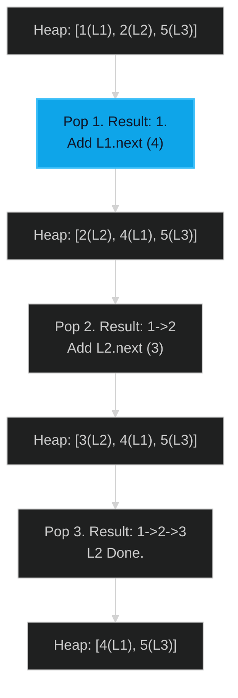

# Merge k Sorted Lists 🔴 Hard

**Tags**: `Heap`, `Linked List`, `Divide and Conquer`

## Prerequisite Topics

| Topic | Difficulty | Relevance | Notes |
|-------|-----------|-----------|-------|
| Min-Heap (Priority Queue) | 🟡 Medium | **Critical** | Efficiently selecting minimum of K heads |
| Linked List Pointers | 🟢 Easy | High | Building the result list |

## The Challenge

You are given an array of `k` linked-lists `lists`, each linked-list is sorted in ascending order.

Merge all the linked-lists into one sorted linked-list and return it.

### Strategic Analysis & Real-World Context

> [!NOTE]
> **Why this matters**: This is exactly how massive scale database sorts (External Merge Sort) work when data doesn't fit in memory.

| Scenario | Preferred Approach | Why? |
|----------|--------------------|------|
| **General ($K$ large)** | **Min-Heap** | $O(N \log K)$. Efficiently tracks the minimum of K streams. |
| **Standard Sort** | **Collect & Sort** | If everything fits in array, Python's Timsort ($O(N \log N)$) is highly optimized and often faster in practice due to C implementation, despite worse theoretical complexity for small K. |
| **Iterative Merge** | **Pairwise** | merging 2 at a time is $O(N \times K)$. Slow. |

**Constraints**:
- $k == lists.length$
- $0 \leq k \leq 10^4$
- $0 \leq lists[i].length \leq 500$
- $-10^4 \leq lists[i][j] \leq 10^4$
- `lists[i]` is sorted.
- sum of lengths $\leq 10^4$.

**Example**:
```python
Input: lists = [[1,4,5],[1,3,4],[2,6]]
Output: [1,1,2,3,4,4,5,6]
```

## Algorithmic Analysis

### Naive Approach
Collect all nodes into a list, sort them, rebuild list.
- **Complexity**: $O(N \log N)$ where $N$ is total nodes. Space $O(N)$.

### Optimal Approach (Min-Heap)
Keep the head of every list in a Min-Heap.
- **Logic**:
    1. Push head of each of the `k` lists into heap.
    2. Pop min element (smallest current head). Append to result list.
    3. If the popped node has a next node, push it to heap.
    4. Repeat until heap empty.
- **Comparison**: This is like "Merge Sort" merge step but for K lists.

## Complexity Analysis

| Dimension | Complexity | Justification |
|-----------|-----------|---------------|
| Time | $O(N \log k)$ | Heap size is at most $k$. $N$ insertions/deletions. |
| Space | $O(k)$ | Heap stores 1 node per list. |

## Visual Walkthrough

Input: `L1: 1->4`, `L2: 2->3`, `L3: 5`



## Solution

```python
def merge_k_lists(self, lists: list[ListNode | None]) -> ListNode | None:
    heap = []
    # Store (val, idx, node) to handle tie-breaking without node comparison
    for i, node in enumerate(lists):
        if node:
            heapq.heappush(heap, (node.val, i, node))
            
    dummy = ListNode()
    curr = dummy
    
    while heap:
        val, i, node = heapq.heappop(heap)
        curr.next = node
        curr = curr.next
        
        if node.next:
            heapq.heappush(heap, (node.next.val, i, node.next))
            
    return dummy.next
```
