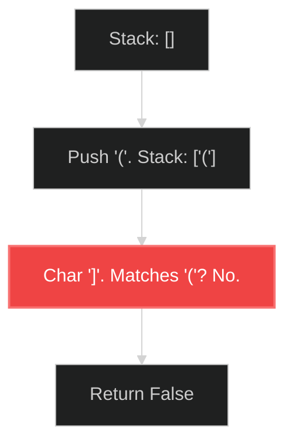

# Valid Parentheses 🟢 Easy

**Tags**: `Stack`, `String`

## Prerequisite Topics

| Topic | Difficulty | Relevance | Notes |
|-------|-----------|-----------|-------|
| Stack Operations | 🟢 Easy | **Critical** | LIFO property |

## The Challenge

Given a string `s` containing just the characters `'('`, `')'`, `'{'`, `'}'`, `'['` and `']'`, determine if the input string is valid.

### Strategic Analysis & Real-World Context

> [!NOTE]
> **Why this matters**: The basis of compilers, parsers (JSON/XML), and code editors (bracket matching).

| Scenario | Preferred Approach | Why? |
|----------|--------------------|------|
| **Standard** | **Stack** | $O(N)$ Time. LIFO perfectly matches nested structure nature. |
| **Memory Extreme** | **Counter** | Only possible if single bracket type `()`. If multiple types, stack is mandatory to track order. |

**Constraints**:
- $1 \leq s.length \leq 10^4$

**Example**:
```python
Input: s = "()[]{}"
Output: true
```

## Algorithmic Analysis

### Optimal Approach (Stack)
Standard stack-based matching.
- **Logic**: Push open brackets. When close bracket appears, pop and check match.
- **Complexity**: $O(N)$ Time, $O(N)$ Space.

## Visual Walkthrough

Input: `(]`



## Solution

```python
def is_valid(self, s: str) -> bool:
    stack = []
    mapping = {")": "(", "}": "{", "]": "["}
    for char in s:
        if char in mapping:
            top = stack.pop() if stack else '#'
            if mapping[char] != top:
                return False
        else:
            stack.append(char)
    return not stack
```
