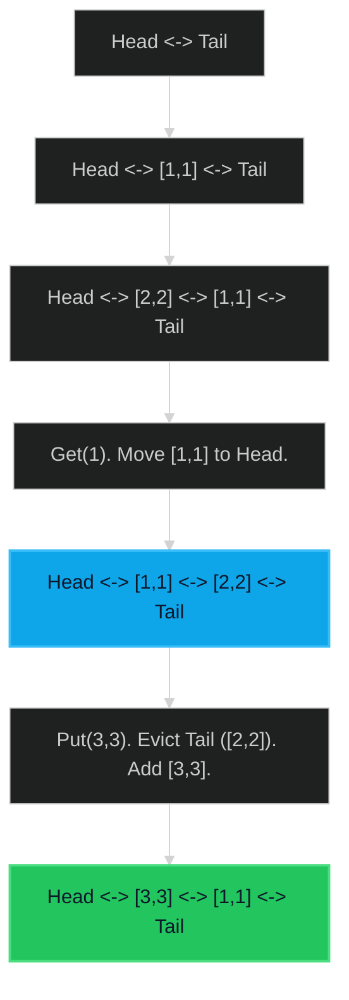

# LRU Cache 🔴 Hard

**Tags**: `Design`, `Hash Table`, `Linked List`, `Doubly Linked List`

## Prerequisite Topics

| Topic | Difficulty | Relevance | Notes |
|-------|-----------|-----------|-------|
| Hash Map | 🟢 Easy | **Critical** | O(1) Key access |
| Doubly Linked List | 🟡 Medium | **Critical** | O(1) Remove/Move |

## The Challenge

Design a data structure that follows the constraints of a **Least Recently Used (LRU) cache**.

Implement the `LRUCache` class:
- `LRUCache(int capacity)` Initialize the LRU cache with positive size `capacity`.
- `int get(int key)` Return the value of the `key` if the key exists, otherwise return `-1`.
- `void put(int key, int value)` Update the value of the `key` if the `key` exists. Otherwise, add the `key-value` pair to the cache. If the number of keys exceeds the `capacity` from this operation, **evict** the least recently used key.

The functions `get` and `put` must each run in $O(1)$ average time complexity.

**Constraints**:
- $1 \leq capacity \leq 3000$
- $0 \leq key \leq 10^4$
- $0 \leq value \leq 10^5$

**Example**:
```python
cache = LRUCache(2)
cache.put(1, 1)
cache.put(2, 2)
cache.get(1)       # returns 1
cache.put(3, 3)    # evicts key 2
cache.get(2)       # returns -1 (not found)
```

## Algorithmic Analysis

### Naive Approach
List of tuples `(key, val, time)`. Sort by time on eviction.
- **Complexity**: $O(N)$ due to search/delete.

### Optimal Approach (HashMap + DLL)
Combine HashMap (fast lookup) with Doubly Linked List (fast ordering).
- **HashMap**: Stores `key -> Node`.
- **DLL**: Maintains order.
    - **Head**: Most Recently Used (MRU).
    - **Tail**: Least Recently Used (LRU).
- **Logic**:
    - `get(k)`: Look up node. Move to Head. Return val.
    - `put(k, v)`:
        - If exists: Update val. Move to Head.
        - If new: Create node. Add to Head. Add to Map.
        - If capacity full: Remove Tail node. Remove from Map.

### Strategic Analysis & Real-World Context

> [!NOTE]
> **Why this matters**: The "Hello World" of system design caching layers (Redis, Memcached).

| Scenario | Preferred Approach | Why? |
|----------|--------------------|------|
| **Standard Cache** | **LRU (Hash+DLL)** | Simple, effective for temporal locality (recently used = likely used again). |
| **Frequency Matters** | **LFU (Min-Heap)** | If "popular" items matter more than "recent" ones (e.g., DNS records). |
| **Simple/Small** | **FIFO (Queue)** | If exact eviction policy matters less than simple implementation. |

## Complexity Analysis

| Dimension | Complexity | Justification |
|-----------|-----------|---------------|
| Time | $O(1)$ | Hash lookup & pointer swaps are constant time. |
| Space | $O(N)$ | Storing N nodes and N map entries. |

## Visual Walkthrough

Capacity 2. `put(1,1)`, `put(2,2)`, `get(1)`.



## Solution

```python
class LRUCache:
    class Node:
        def __init__(self, key, val):
            self.key = key
            self.val = val
            self.prev = None
            self.next = None

    def __init__(self, capacity: int):
        self.capacity = capacity
        self.cache = {}
        self.head = self.Node(0, 0)
        self.tail = self.Node(0, 0)
        self.head.next = self.tail
        self.tail.prev = self.head

    def _remove(self, node):
        prev_node = node.prev
        next_node = node.next
        prev_node.next = next_node
        next_node.prev = prev_node

    def _add(self, node):
        prev_node = self.tail.prev
        prev_node.next = node
        node.prev = prev_node
        node.next = self.tail
        self.tail.prev = node

    def get(self, key: int) -> int:
        if key in self.cache:
            node = self.cache[key]
            self._remove(node)
            self._add(node)
            return node.val
        return -1

    def put(self, key: int, value: int) -> None:
        if key in self.cache:
            self._remove(self.cache[key])
        node = self.Node(key, value)
        self._add(node)
        self.cache[key] = node
        
        if len(self.cache) > self.capacity:
            lru = self.head.next
            self._remove(lru)
            del self.cache[lru.key]
```
