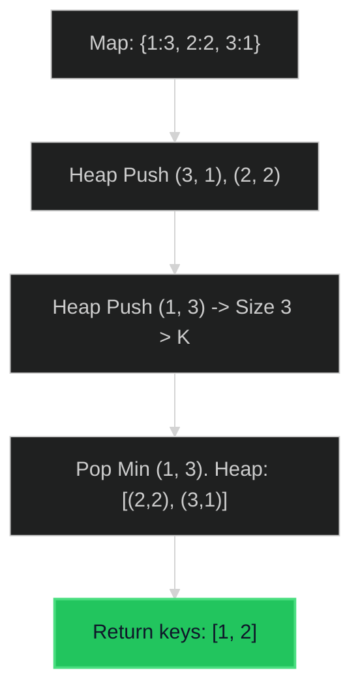

# Top K Frequent Elements 🟡 Medium

**Tags**: `Heap`, `Hash Table`, `Sorting`

## Prerequisite Topics

| Topic | Difficulty | Relevance | Notes |
|-------|-----------|-----------|-------|
| Hash Map (Frequency) | 🟢 Easy | **Critical** | Counting occurrences |
| Min-Heap (K size) | 🟡 Medium | High | Keep top K efficiently |

## The Challenge

Given an integer array `nums` and an integer `k`, return the `k` most frequent elements. You may return the answer in **any order**.

**Constraints**:
- $1 \leq nums.length \leq 10^5$
- `k` is in the range `[1, the number of unique elements in the array]`.
- It is guaranteed that the answer is unique.

**Example**:
```python
Input: nums = [1,1,1,2,2,3], k = 2
Output: [1,2]
```

## Algorithmic Analysis

### Naive Approach
Count frequencies, sort by frequency.
- **Complexity**: $O(N \log N)$ (sorting).
- **Good enough?**: Often yes, but $O(N \log K)$ is better if $N$ huge and $K$ small.

### Optimal Approach (Min-Heap / Bucket Sort)
1. **Hash Map**: Count freq $O(N)$.
2. **Min-Heap**: Keep size $K$.
    - Push `(freq, num)`.
    - If size > K, Pop min.
    - Remaining K are the largest.
    - **Complexity**: $O(N \log K)$.
3. **Bucket Sort (O(N))**:
    - Freq can be at most N.
    - Array `buckets[freq] = [nums]`.
    - Iterate buckets from N down to 1. Collect K nums.

### Strategic Analysis & Real-World Context

> [!NOTE]
> **Why this matters**: Analyzing logs (top IP addresses), Trending Topics (hashtags), Recommender Systems.

| Scenario | Preferred Approach | Why? |
|----------|--------------------|------|
| **Streaming Data** | **Min-Heap (Size K)** | Can process infinite stream, only storing K items in memory. |
| **Bounded Input** | **Bucket Sort** | $O(N)$ is strictly better than $O(N \log K)$ if we know max frequency $\leq N$. |
| **Simple** | **Sorting** | Python's `Counter.most_common(k)` uses `heapq.nlargest` internally ($O(N \log K)$). |

## Complexity Analysis

| Dimension | Complexity | Justification |
|-----------|-----------|---------------|
| Time | $O(N \log k)$ | Heap operations. |
| Space | $O(N)$ | Hash Map storage. |

## Visual Walkthrough

Input: `[1,1,1, 2,2, 3]`, `k=2`



## Solution

```python
def top_k_frequent(self, nums: list[int], k: int) -> list[int]:
    count = Counter(nums)
    return heapq.nlargest(k, count.keys(), key=count.get)
```
