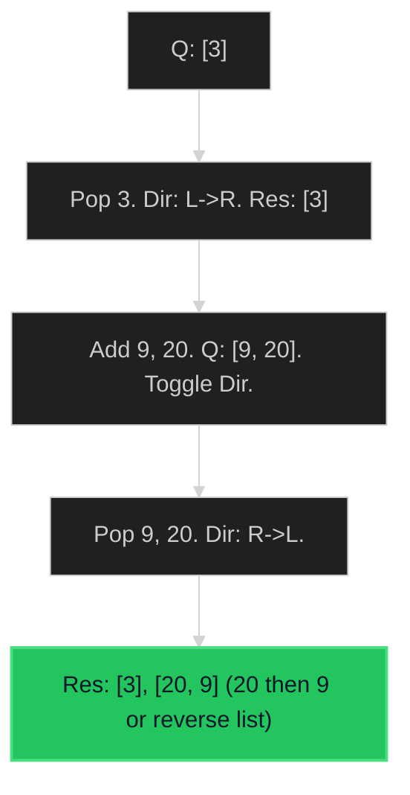

# Binary Tree Zigzag Level Order Traversal 🟡 Medium

**Tags**: `Tree`, `BFS`

## Prerequisite Topics

| Topic | Difficulty | Relevance | Notes |
|-------|-----------|-----------|-------|
| BFS (Level Order) | 🟢 Easy | **Critical** | Core logic |
| Deque Operations | 🟢 Easy | High | Efficient front/back appending |

## The Challenge

Given the `root` of a binary tree, return the *zigzag level order traversal* of its nodes' values. (i.e., from left to right, then right to left for the next level and alternate between).

**Constraints**:
- Number of nodes in range $[0, 2000]$.

**Example**:
```python
Input: root = [3,9,20,null,null,15,7]
Output: [[3],[20,9],[15,7]]
```

## Algorithmic Analysis

### Optimal Approach (BFS + Deque)
Standard BFS but control insertion direction.
- **Logic**: Use a flag `left_to_right`.
    - If `True`: Append to tail of level list.
    - If `False`: Append to head (or reverse list at end).
    - Toggle flag after each level.

### Strategic Analysis & Real-World Context

> [!NOTE]
> **Why this matters**: UI rendering patterns (Z-scan), specific network routing topologies.

| Scenario | Preferred Approach | Why? |
|----------|--------------------|------|
| **Standard** | **BFS + Deque** | $O(N)$ Time. Efficiently builds level lists without post-reversal. |
| **Alternative** | **Two Stacks** | Use 2 stacks to simulate order reversal, but BFS is more idiomatic for "level" tasks. |

## Complexity Analysis

| Dimension | Complexity | Justification |
|-----------|-----------|---------------|
| Time | $O(N)$ | Visit each node once. |
| Space | $O(N)$ | Queue stores max width of tree (N/2). |

## Visual Walkthrough

Input: `[3, 9, 20]`



## Solution

```python
def zigzag_level_order(self, root: TreeNode | None) -> list[list[int]]:
    if not root: return []
    results = []
    queue = deque([root])
    left_to_right = True
    
    while queue:
        level_size = len(queue)
        current_level = deque()
        for _ in range(level_size):
            node = queue.popleft()
            if left_to_right:
                current_level.append(node.val)
            else:
                current_level.appendleft(node.val)
            if node.left: queue.append(node.left)
            if node.right: queue.append(node.right)
        results.append(list(current_level))
        left_to_right = not left_to_right
    return results
```
