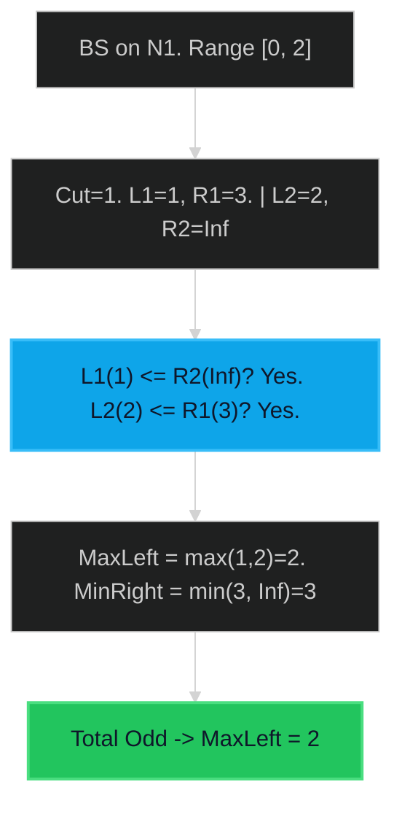

# Median of Two Sorted Arrays 🔴 Hard

**Tags**: `Array`, `Binary Search`, `Divide and Conquer`

## Prerequisite Topics

| Topic | Difficulty | Relevance | Notes |
|-------|-----------|-----------|-------|
| Binary Search | 🟢 Easy | **Critical** | Finding partition point |

## The Challenge

Given two sorted arrays `nums1` and `nums2` of size `m` and `n` respectively, return the median of the two sorted arrays.

The overall run time complexity should be $O(\log (m+n))$.

**Constraints**:
- $nums1.length == m$
- $nums2.length == n$
- $0 \leq m \leq 1000$
- $0 \leq n \leq 1000$
- $1 \leq m + n \leq 2000$

**Example**:
```python
Input: nums1 = [1,3], nums2 = [2]
Output: 2.0
Explanation: merged array = [1,2,3] and median is 2.
```

## Algorithmic Analysis

### Naive Approach
Merge arrays ($O(M+N)$), find middle.
- **Fail**: Violates $O(\log (M+N))$ complexity constraint.

### Optimal Approach (Bin Search on Partition)
Find a partition in `nums1` (size $M$) and `nums2` (size $N$) such that left half contains same # of elements as right half, and `max(Left) <= min(Right)`.
- **Search Space**: Cut indices of smaller array ($0$ to $M$).
- **Conditions**: `L1 <= R2` and `L2 <= R1`.
    - If `L1 > R2`: Cut too far right. Move Left.
    - If `L2 > R1`: Cut too far left. Move Right.

### Strategic Analysis & Real-World Context

> [!NOTE]
> **Why this matters**: Distributed databases (calculating stats across shards) without merging.

| Scenario | Preferred Approach | Why? |
|----------|--------------------|------|
| **Standard** | **Bin Search (Partition)** | $O(\log(\min(M,N)))$. Fastest possible. |
| **Uneven Sizes** | **Bin Search** | Searching on the smaller array ($M \ll N$) is extremely fast. |

## Complexity Analysis

| Dimension | Complexity | Justification |
|-----------|-----------|---------------|
| Time | $O(\log(\min(M, N)))$ | BS on smaller array. |
| Space | $O(1)$ | No extra storage. |

## Visual Walkthrough

`N1=[1,3], N2=[2]`



## Solution

```python
def find_median_sorted_arrays(self, nums1: list[int], nums2: list[int]) -> float:
    if len(nums1) > len(nums2): nums1, nums2 = nums2, nums1
    m, n = len(nums1), len(nums2)
    start, end = 0, m
    
    while start <= end:
        partition1 = (start + end) // 2
        partition2 = (m + n + 1) // 2 - partition1
        
        max_left1 = float('-inf') if partition1 == 0 else nums1[partition1 - 1]
        min_right1 = float('inf') if partition1 == m else nums1[partition1]
        
        max_left2 = float('-inf') if partition2 == 0 else nums2[partition2 - 1]
        min_right2 = float('inf') if partition2 == n else nums2[partition2]
        
        if max_left1 <= min_right2 and max_left2 <= min_right1:
            if (m + n) % 2 == 0:
                return (max(max_left1, max_left2) + min(min_right1, min_right2)) / 2.0
            else:
                return max(max_left1, max_left2)
        elif max_left1 > min_right2:
            end = partition1 - 1
        else:
            start = partition1 + 1
    raise ValueError("Not sorted")
```
