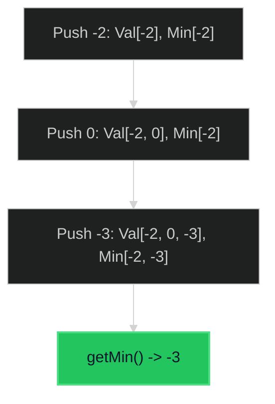

# Min Stack 🟢 Easy

**Tags**: `Stack`, `Design`

## Prerequisite Topics

| Topic | Difficulty | Relevance | Notes |
|-------|-----------|-----------|-------|
| Stack Operations | 🟢 Easy | **Critical** | LIFO principle |
| Auxiliary Space | 🟢 Easy | High | Tracking minimums |

## The Challenge

Design a stack that supports push, pop, top, and retrieving the minimum element in constant time.

**Constraints**:
- $-2^{31} \leq val \leq 2^{31} - 1$
- Methods `pop`, `top` and `getMin` operations will always be called on non-empty stacks.

**Example**:
```python
minStack = MinStack()
minStack.push(-2)
minStack.push(0)
minStack.push(-3)
minStack.getMin() # return -3
minStack.pop()
minStack.top()    # return 0
minStack.getMin() # return -2
```

## Algorithmic Analysis

### Optimal Approach (Two Stacks)
We use a primary stack for values and an auxiliary "min stack" to keep track of the minimum value at each state.
- **Push**: Add to primary stack. If value $\leq$ current min, add to min stack.
- **Pop**: If popped value == current min, pop from min stack too.
- **GetMin**: Return top of min stack.

## Complexity Analysis

| Dimension | Complexity | Justification |
|-----------|-----------|---------------|
| Time | $O(1)$ | All operations are constant time. |
| Space | $O(N)$ | Additional stack to store minimums. |

## Visual Walkthrough



## Solution

```python
class MinStack:
    def __init__(self):
        self.stack = []
        self.min_stack = []

    def push(self, val: int) -> None:
        self.stack.append(val)
        if not self.min_stack or val <= self.min_stack[-1]:
            self.min_stack.append(val)

    def pop(self) -> None:
        if self.stack.pop() == self.min_stack[-1]:
            self.min_stack.pop()

    def top(self) -> int:
        return self.stack[-1]

    def get_min(self) -> int:
        return self.min_stack[-1]
```
