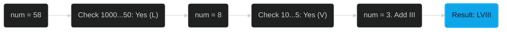

# Integer to Roman 🟡 Medium

**Tags**: `Math`, `String`, `Greedy`

## Prerequisite Topics

| Topic | Difficulty | Relevance | Notes |
|-------|-----------|-----------|-------|
| Roman Numerals | 🟢 Easy | **Critical** | Understanding symbols (I, V, X, L, C, D, M) |
| Greedy Algorithm | 🟢 Easy | High | Always taking the largest symbol possible |

## The Challenge

Convert an integer to a Roman numeral string.

**Constraints**:
- $1 \leq num \leq 3999$

**Example**:
```python
Input: num = 1994
Output: "MCMXCIV"
Explanation: M = 1000, CM = 900, XC = 90, IV = 4.
```

## Algorithmic Analysis

### Optimal Approach (Greedy)
Define a mapping of values to Roman numeral symbols in descending order (including subtractive cases like 900 being CM).
- **Strategy**: Iterate through the mapping. While `num` is $\geq$ current value, append the symbol and subtract the value from `num`.
- **Why it works**: Roman numerals are naturally greedy; we use the largest symbols first.

## Complexity Analysis

| Dimension | Complexity | Justification |
|-----------|-----------|---------------|
| Time | $O(1)$ | Finite number of symbols (max 3999). |
| Space | $O(1)$ | Result string is small. |

## Visual Walkthrough



## Solution

```python
def int_to_roman(self, num: int) -> str:
    val_map = [
        (1000, "M"), (900, "CM"), (500, "D"), (400, "CD"),
        (100, "C"), (90, "XC"), (50, "L"), (40, "XL"),
        (10, "X"), (9, "IX"), (5, "V"), (4, "IV"), (1, "I")
    ]
    roman = []
    for val, symbol in val_map:
        while num >= val:
            roman.append(symbol)
            num -= val
    return "".join(roman)
```
