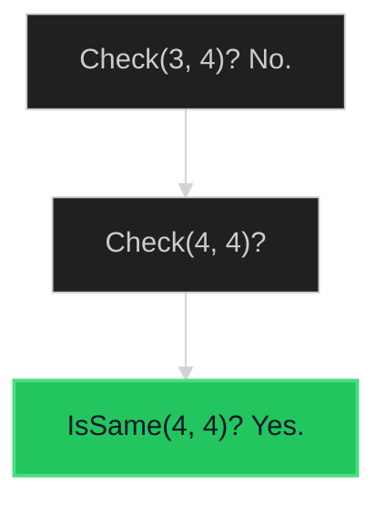

# Subtree of Another Tree 🟢 Easy

**Tags**: `Tree`, `DFS`, `String Matching`

## Prerequisite Topics

| Topic | Difficulty | Relevance | Notes |
|-------|-----------|-----------|-------|
| Tree Traversal (DFS) | 🟢 Easy | **Critical** | Navigating both trees |
| Recursion | 🟢 Easy | **Critical** | Base cases |

## The Challenge

Given the roots of two binary trees `root` and `subRoot`, return `true` if there is a subtree of `root` with the same structure and node values as `subRoot` and `false` otherwise.

**Constraints**:
- Number of nodes in `root` $\leq 2000$.
- Number of nodes in `subRoot` $\leq 1000$.

**Example**:
```python
Input: root = [3,4,5,1,2], subRoot = [4,1,2]
Output: true
```

## Algorithmic Analysis

### Naive Approach (O(M*N))
For every node in `root`, check if the subtree rooted there is identical to `subRoot`.
- `is_same` check takes $O(M)$ where $M$ is nodes in `subRoot`.
- We do this for $N$ nodes in `root`.
- Total: $O(M \times N)$.

### Optimal Approach (Merkle Hashing / String Serialize)
Serialize both trees to strings (e.g., Pre-order with null markers). Check if `subRoot` string is substring of `root` string.
- **Complexity**: $O(M+N)$ (KMP for substring check).
- **Trade-off**: Requires $O(M+N)$ space for strings.

### Strategic Analysis & Real-World Context

> [!NOTE]
> **Why this matters**: Filesystem hierarchy checks, DOM tree manipulation.

| Scenario | Preferred Approach | Why? |
|----------|--------------------|------|
| **Standard** | **DFS (Naive)** | $O(M \times N)$ is fine for $N=2000$. Logic is simplest. |
| **Large Scale** | **Merkle Hash** | Compute hash of every subtree. Compare hashes in $O(1)$. Total $O(M+N)$. |

## Complexity Analysis

| Dimension | Complexity | Justification |
|-----------|-----------|---------------|
| Time | $O(M \times N)$ | Worst case (skewed trees). |
| Space | $O(N)$ | Recursion stack height. |

## Visual Walkthrough

`Root: [3,4,5]`, `Sub: [4]`



## Solution

```python
def is_subtree(self, root: TreeNode | None, subRoot: TreeNode | None) -> bool:
    if not root: return False
    if self._is_same_tree(root, subRoot): return True
    return self.is_subtree(root.left, subRoot) or self.is_subtree(root.right, subRoot)

def _is_same_tree(self, p: TreeNode | None, q: TreeNode | None) -> bool:
    if not p and not q: return True
    if not p or not q or p.val != q.val: return False
    return self._is_same_tree(p.left, q.left) and self._is_same_tree(p.right, q.right)
```
