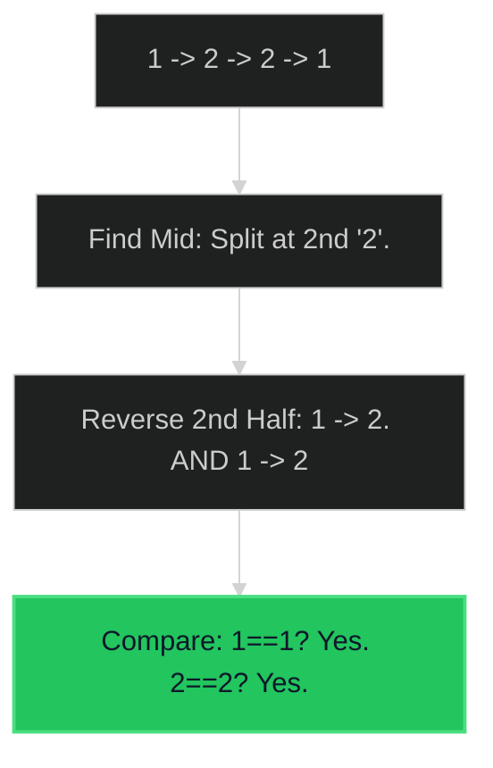

# Palindrome Linked List 🟢 Easy

**Tags**: `Linked List`, `Two Pointers`

## Prerequisite Topics

| Topic | Difficulty | Relevance | Notes |
|-------|-----------|-----------|-------|
| Fast & Slow Pointers | 🟢 Easy | **Critical** | Finding middle |
| List Reversal | 🟢 Easy | **Critical** | Modifying second half |

## The Challenge

Given the `head` of a singly linked list, return `true` if it is a palindrome or `false` otherwise.

**Constraints**:
- Number of nodes in range $[1, 10^5]$.
- $O(N)$ time and $O(1)$ space.

**Example**:
```python
Input: head = [1,2,2,1]
Output: true
```

## Algorithmic Analysis

### Naive Approach
Copy to array `vals = []`. Check `vals == vals[::-1]`.
- **Space**: $O(N)$. Violation of challenge constraint.

### Optimal Approach (Reverse Second Half)
1. Find middle (Fast/Slow pointers).
2. Reverse second half of list.
3. Compare first half vs reversed second half.
4. (Optional) Restore list.

### Strategic Analysis & Real-World Context

> [!NOTE]
> **Why this matters**: Memory-constrained environments where allocating $O(N)$ buffer is forbidden.

| Scenario | Preferred Approach | Why? |
|----------|--------------------|------|
| **Strict Constraints** | **Reverse Half** | $O(1)$ Space. The only way to meet constraints. |
| **Simplicity** | **Array Copy** | If memory allows, copying is 2 lines of code vs 20. |

## Complexity Analysis

| Dimension | Complexity | Justification |
|-----------|-----------|---------------|
| Time | $O(N)$ | Two passes (find mid, reverse/check). |
| Space | $O(1)$ | Manipulating pointers in place. |

## Visual Walkthrough

`[1, 2, 2, 1]`



## Solution

```python
def is_palindrome(self, head: ListNode | None) -> bool:
    if not head or not head.next: return True
    
    # 1. Find middle
    slow, fast = head, head
    while fast and fast.next:
        slow = slow.next
        fast = fast.next.next
        
    # 2. Reverse second half
    prev = None
    curr = slow
    while curr:
        temp = curr.next
        curr.next = prev
        prev = curr
        curr = temp
        
    # 3. Compare halves
    left, right = head, prev
    while right:
        if left.val != right.val: return False
        left = left.next
        right = right.next
    return True
```
