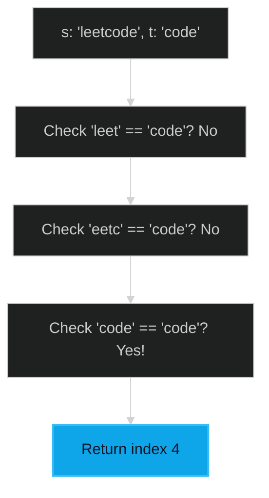

# Check If a String is a Substring 🟢 Easy

**Tags**: `String`, `Two Pointers`, `String Matching`

## Prerequisite Topics

| Topic | Difficulty | Relevance | Notes |
|-------|-----------|-----------|-------|
| String Slicing | 🟢 Easy | High | Extracting subsegments |
| Pattern Matching | 🟡 Medium | Moderate | KMP/Rabin-Karp (advanced) |

## The Challenge

Given two strings `s` and `t`, return the index of the first occurrence of `t` in `s`, or `-1` if `t` is not part of `s`.

**Constraints**:
- $1 \leq s.length, t.length \leq 10^4$
- `s` and `t` consist of only lowercase English characters.

**Example**:
```python
Input: s = "sadbutsad", t = "sad"
Output: 0
Explanation: "sad" occurs at index 0 and 6. The first occurrence is at 0.
```

## Algorithmic Analysis

### Naive Approach (Sliding Window)
Check every window of length `len(t)` in `s`.
- **Time Complexity**: $O(N \times M)$ where $N$ is length of `s` and $M$ is length of `t`.
- **Verdict**: Sufficient for $N, M \leq 10^4$ in most cases, but $O(N+M)$ is possible using KMP.

### Optimal Approach (KMP - Overview)
The Knuth-Morris-Pratt algorithm avoids re-scanning characters by using a partial match table (LPS array).
- **Key Insight**: If we fail a match, we know because of the pattern's properties where the next valid match could start.

## Complexity Analysis

| Dimension | Complexity | Justification |
|-----------|-----------|---------------|
| Time | $O(N \times M)$ | Simple implementation using slicing. |
| Space | $O(1)$ | No extra space beyond result. |

## Visual Walkthrough



## Solution

```python
def is_substring(self, s: str, t: str) -> int:
    if not t: return 0
    n, m = len(s), len(t)
    for i in range(n - m + 1):
        if s[i : i + m] == t:
            return i
    return -1
```
