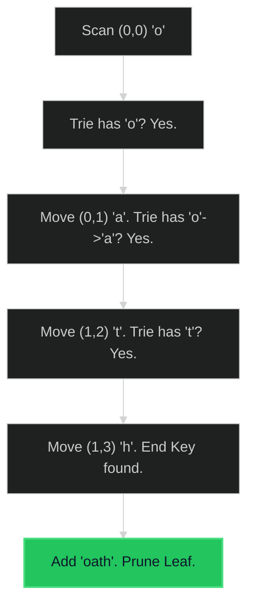

# Word Search II 🔴 Hard

**Tags**: `Trie`, `Backtracking`, `DFS`

## Prerequisite Topics

| Topic | Difficulty | Relevance | Notes |
|-------|-----------|-----------|-------|
| Trie (Prefix Tree) | 🟡 Medium | **Critical** | Efficient prefix checking |
| Backtracking | 🟡 Medium | **Critical** | Exploring board paths |

## The Challenge

Given an `m x n` `board` of characters and a list of strings `words`, return all words on the board.

Each word must be constructed from letters of sequentially adjacent cells, where adjacent cells are horizontally or vertically neighboring. The same letter cell may not be used more than once in a word.

**Constraints**:
- $m == board.length$, $n == board[i].length$
- $1 \leq m, n \leq 12$
- $1 \leq words.length \leq 3 \times 10^4$

**Example**:
```python
Input: board = [["o","a","a","n"],["e","t","a","e"],["i","h","k","r"],["i","f","l","v"]], words = ["oath","pea","eat","rain"]
Output: ["eat","oath"]
```

## Algorithmic Analysis

### Naive Approach
For each word, run DFS on board.
- **Complexity**: $O(W \cdot M \cdot N \cdot 4^L)$ where $W$ is words, $L$ is word length.
- **Fail**: Redundant paths (e.g., "oat" visited for "oath" and "oats").

### Optimal Approach (Trie + DFS)
Build a Trie of all words. Run DFS on board **once**.
- **Logic**:
    1. Insert all words into Trie.
    2. Iterate every cell $(r, c)$. Start DFS.
    3. At each step, check if current path exists in Trie.
    4. If Trie node has a "Word End" marker, add to results.
    5. **Optimization**: Prune Trie nodes when matched to avoid re-finding.

### Strategic Analysis & Real-World Context

> [!NOTE]
> **Why this matters**: Bogle solvers, Scrabble AI, Phone contact search.

| Scenario | Preferred Approach | Why? |
|----------|--------------------|------|
| **Many Words** | **Trie + DFS** | Compresses common prefixes. Efficient. |
| **Few Words** | **DFS per Word** | Simple loop might be faster due to Trie overhead if $W < 5$. |

## Complexity Analysis

| Dimension | Complexity | Justification |
|-----------|-----------|---------------|
| Time | $O(M \cdot N \cdot 4^L)$ | Traverse board ($MN$), explore paths ($4^L$). Trie interaction is $O(1)$. |
| Space | $O(W \cdot L)$ | Trie storage. |

## Visual Walkthrough

Board: `o, a` ... Word: `oath`



## Solution

```python
def find_words(self, board: list[list[str]], words: list[str]) -> list[str]:
    WORD_KEY = '$'
    trie = {}
    for word in words:
        node = trie
        for letter in word:
            node = node.setdefault(letter, {})
        node[WORD_KEY] = word
        
    row_num, col_num = len(board), len(board[0])
    matched_words = []
    
    def backtracking(row, col, parent):
        letter = board[row][col]
        curr_node = parent[letter]
        
        # Check for match
        if WORD_KEY in curr_node:
            matched_words.append(curr_node[WORD_KEY])
            del curr_node[WORD_KEY] # Prevent duplicate adds
            
        board[row][col] = '#' # mark visited
        
        for r_offset, c_offset in [(0, 1), (0, -1), (1, 0), (-1, 0)]:
            new_r, new_c = row + r_offset, col + c_offset
            if 0 <= new_r < row_num and 0 <= new_c < col_num and board[new_r][new_c] in curr_node:
                backtracking(new_r, new_c, curr_node)
                
        board[row][col] = letter # backtrack
        
        # Optimization: Prune empty nodes
        if not curr_node:
            del parent[letter]
            
    for r in range(row_num):
        for c in range(col_num):
            if board[r][c] in trie:
                backtracking(r, c, trie)
                
    return matched_words
```
