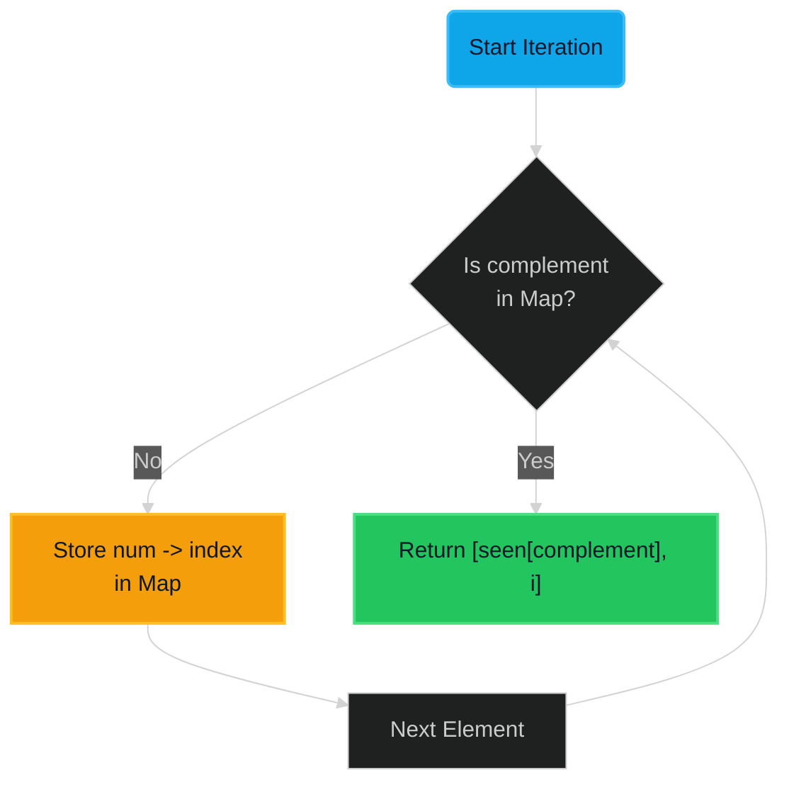

# Two Sum 🟢 Easy

**Tags**: `Array`, `Hash Map`

## Prerequisite Topics

| Topic | Difficulty | Relevance | Notes |
|-------|-----------|-----------|-------|
| Hash Map Operations | 🟢 Easy | **Critical** | O(1) lookups are key to optimal solution |
| Array Iteration | 🟢 Easy | High | Foundation for traversing inputs |

## The Challenge

Given an array of integers `nums` and an integer `target`, return indices of the two numbers such that they add up to `target`.

You may assume that each input would have **exactly one solution**, and you may not use the same element twice.

**Constraints**:
- $2 \leq nums.length \leq 10^4$
- $-10^9 \leq nums[i] \leq 10^9$
- $-10^9 \leq target \leq 10^9$
- Only one valid answer exists.

**Example**:
```python
Input: nums = [2, 7, 11, 15], target = 9
Output: [0, 1]
Explanation: nums[0] + nums[1] = 2 + 7 = 9
```

## Algorithmic Analysis

### Naive/Brute Force
The intuitive approach is to check every pair of numbers.
- **Method**: Use a nested loop. Outer loop picks `nums[i]`, inner loop checks `nums[j]` where `j > i`.
- **Failure**: Time complexity is $O(N^2)$.
    - For $N=10^4$, operations $\approx 10^8$, which borders on Time Limit Exceeded (TLE) in stricter environments (usually ~10^8 ops/sec).
    - Inefficient compared to linear time.

### Optimal Approach (Hash Map)
Instead of scanning for the complement repeatedly, we can "remember" what we've seen.
- **Key Insight**: Logic `a + b = target` can be rewritten as `a = target - b`.
- **Strategy**: As we iterate through `nums`, for each number `x`, we check if `target - x` exists in our history.
- **Data Structure**: A Hash Map (Dictionary) stores `value -> index` for $O(1)$ access.
- **Flow**:
    1. Initialize empty dict `seen`.
    2. Iterate `i, num` in inputs.
    3. Calc `complement = target - num`.
    4. If `complement` in `seen`, return `[seen[complement], i]`.
    5. Else, add `num -> i` to `seen`.

### Trade-offs
- **Hash Map**: Uses $O(N)$ space to achieve $O(N)$ time.
- **Sorting**: If we sorted first ($O(N \log N)$), we could use Two Pointers.
    - Cons: Indices are lost during sorting (need extra space/logic to track original indices).
    - Pros: Less space ($O(1)$ or $O(\log N)$ depending on sort) if map overhead is high.
    - **Verdict**: Hash Map is standard for unsorted arrays needing index returns.

## Complexity Analysis

| Dimension | Complexity | Justification |
|-----------|-----------|---------------|
| Time | $O(N)$ | Single pass through the array. Hash map lookups are avg $O(1)$. |
| Space | $O(N)$ | In worst case (no solution found until end), map stores $N$ elements. |

## Visual Walkthrough



## Solution

```python
def two_sum(self, nums: list[int], target: int) -> list[int]:
    # Dictionary to store mapping: value -> index
    seen: dict[int, int] = {}
    
    for i, num in enumerate(nums):
        complement = target - num
        if complement in seen:
            return [seen[complement], i]
        seen[num] = i
    return []
```
