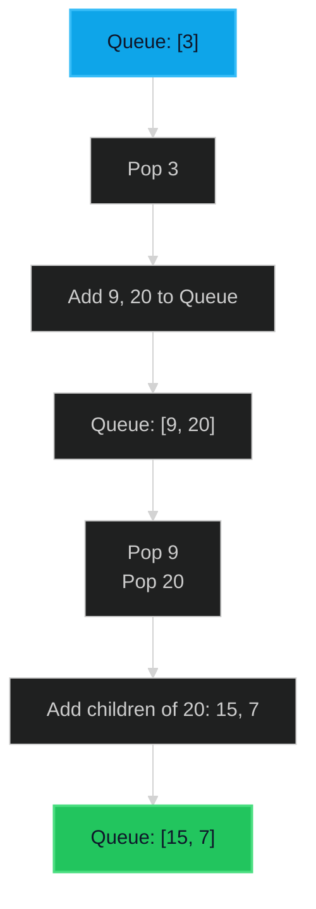

# Binary Tree Level Order Traversal 🟡 Medium

**Tags**: `Tree`, `Breadth-First Search`, `Queue`

## Prerequisite Topics

| Topic | Difficulty | Relevance | Notes |
|-------|-----------|-----------|-------|
| Queue Operations | 🟢 Easy | Critical | FIFO property essential for level order |
| Tree Traversal | 🟢 Easy | High | Understanding of node structure |

## The Challenge

Given the `root` of a binary tree, return the *level order traversal* of its nodes' values. (i.e., from left to right, level by level).

**Constraints**:
- The number of nodes in the tree is in the range $[0, 2000]$.
- $-1000 \leq Node.val \leq 1000$

**Example**:
```python
Input: root = [3,9,20,null,null,15,7]
Output: [[3],[9,20],[15,7]]
```

## Algorithmic Analysis

### Naive Approach
A depth-first search (DFS) can reach all nodes, but grouping them by level requires passing a `level` index and maintaining a list of lists.
- **DFS**: Works, but strictly speaking, Level Order *is* BFS.
- **Recursion**: Can hit stack depth limits for skewed trees (though constraints here are small).

### Optimal Approach (BFS)
Use a Queue to process nodes level by level.
- **Key Insight**: We can process all nodes currently in the queue (which represent one level), add their children to the back, and repeat.
- **Algorithm**:
    1. Initialize `queue` with `root`.
    2. While `queue` is not empty:
        a. Get `level_size = len(queue)`.
        b. Loop `level_size` times:
            i. Pop node.
            ii. Add val to current level list.
            iii. Add children (left, right) to queue.
        c. Add current level list to results.
- **Data Structure**: `collections.deque` for $O(1)$ popleft.

## Complexity Analysis

| Dimension | Complexity | Justification |
|-----------|-----------|---------------|
| Time | $O(N)$ | Each node is processed exactly once. |
| Space | $O(N)$ | In worst case (perfect binary tree), the last level contains $N/2$ nodes. |

## Visual Walkthrough



## Solution

```python
def level_order(self, root: TreeNode | None) -> list[list[int]]:
    if not root:
        return []
    results = []
    queue = deque([root])
    while queue:
        level_values = []
        for _ in range(len(queue)):
            node = queue.popleft()
            level_values.append(node.val)
            if node.left: queue.append(node.left)
            if node.right: queue.append(node.right)
        results.append(level_values)
    return results
```
