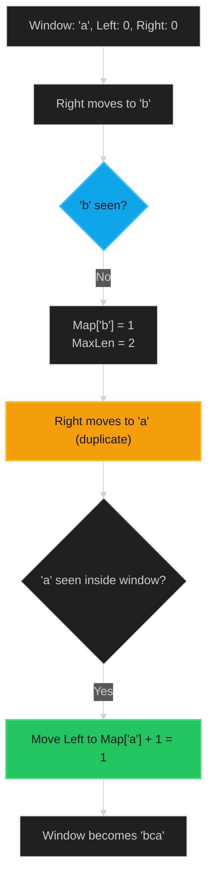

# Longest Substring Without Repeating Characters 🟡 Medium

**Tags**: `String`, `Sliding Window`, `Hash Table`

## Prerequisite Topics

| Topic | Difficulty | Relevance | Notes |
|-------|-----------|-----------|-------|
| Sliding Window | 🟡 Medium | **Critical** | Core technique for subarray/substring problems |
| Hash Map Operations | 🟢 Easy | High | Used for O(1) character index lookups |
| Two Pointers | 🟢 Easy | High | Managing window boundaries |

## The Challenge

Given a string `s`, find the length of the **longest substring** without repeating characters.

**Constraints**:
- $0 \leq s.length \leq 5 * 10^4$
- `s` consists of English letters, digits, symbols and spaces.

**Example**:
```python
Input: s = "abcabcbb"
Output: 3
Explanation: The answer is "abc", with the length of 3.
```

## Algorithmic Analysis

### Naive/Brute Force
Check every possible substring to see if it has duplicates.
- **Method**: Nested loops to generate all substrings ($O(N^2)$), then check uniqueness ($O(N)$).
- **Failure**: Complexity $O(N^3)$, or $O(N^2)$ with optimization. Too slow for $N=50,000$.

### Optimal Approach (Sliding Window)
Use a window `[left, right]` that expands to the right and contracts from the left when a duplicate is found.
- **Key Insight**: We don't need to shrink strictly one by one. If `s[right]` is a duplicate of `s[index]`, we can jump `left` directly to `index + 1`.
- **Strategy**: 
    1. Maintain `char_index_map` storing the *last seen index* of every char.
    2. Expand `right` pointer from 0 to end.
    3. If `s[right]` exists in map and is inside the current window (`map[char] >= left`), update `left` to `map[char] + 1`.
    4. Update `map[s[right]] = right`.
    5. Track `max_length`.

### Trade-offs
- **Hash Map vs Set**: Map allows "jumping" `left` pointer. A Set requires shrinking `left` one by one until duplicate is removed (amortized O(2N) vs strict O(N)).

## Complexity Analysis

| Dimension | Complexity | Justification |
|-----------|-----------|---------------|
| Time | $O(N)$ | Single pass. Each character processed constant times. |
| Space | $O(M)$ | $M$ is size of charset (e.g., 26 for letters, 128 for ASCII). |

## Visual Walkthrough



## Solution

```python
def length_of_longest_substring(self, s: str) -> int:
    char_index_map = {}
    max_length = 0
    left = 0
    
    for right, char in enumerate(s):
        if char in char_index_map and char_index_map[char] >= left:
            left = char_index_map[char] + 1
        
        char_index_map[char] = right
        max_length = max(max_length, right - left + 1)
        
    return max_length
```
