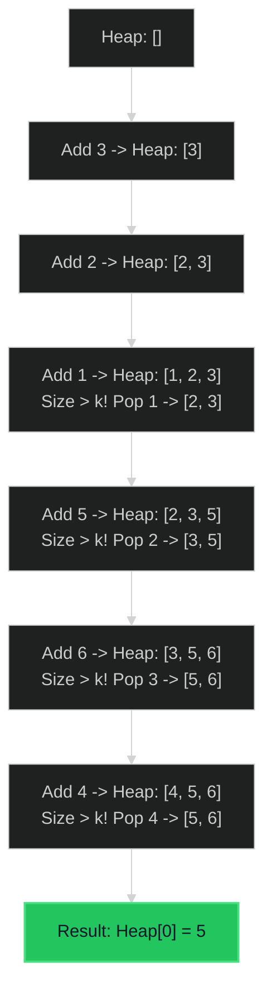

# Kth Largest Element in an Array 🟡 Medium

**Tags**: `Array`, `Divide and Conquer`, `Sorting`, `Heap`, `QuickSelect`

## Prerequisite Topics

| Topic | Difficulty | Relevance | Notes |
|-------|-----------|-----------|-------|
| Heap (Priority Queue) | 🟡 Medium | **Critical** | Efficiently tracks top K elements |
| Sorting | 🟢 Easy | High | Simple but less efficient (O(N log N)) solution |

## The Challenge

Given an integer array `nums` and an integer `k`, return the $k^{th}$ largest element in the array.

Note that it is the $k^{th}$ largest element in the sorted order, not the $k^{th}$ distinct element.

**Constraints**:
- $1 \leq k \leq nums.length \leq 10^5$
- $-10^4 \leq nums[i] \leq 10^4$

**Example**:
```python
Input: nums = [3,2,1,5,6,4], k = 2
Output: 5
```

## Algorithmic Analysis

### Naive Approach (Sorting)
Sort the entire array descending and pick index `k-1`.
- **Complexity**: $O(N \log N)$ time, $O(1)$ space (if in-place sort) or $O(N)$ (if Timsort/MergeSort).
- **Verdict**: Acceptable, but we can do better if $N$ is huge and $K$ is small.

### Optimal Approach (Min-Heap)
Maintain a "Top K Candidates" club.
- **Concept**: A Min-Heap of size `k` holds the $k$ largest elements seen so far.
- **Why Min-Heap?** The root is the *smallest* of the big guys. If a new number is bigger than the root, it deserves to be in the club, so we evict the root (smallest giant) and add the new number.
- **Result**: After processing all numbers, the root of the heap is the $k^{th}$ largest (the smallest of the top $k$).

### Alternative (QuickSelect)
- **Concept**: Partition array like QuickSort.
- **Complexity**: Avg $O(N)$, Worst $O(N^2)$.
- **Verdict**: Better average time, but Min-Heap is deterministic $O(N \log K)$ and easier to implement safely without randomization.

## Complexity Analysis

| Dimension | Complexity | Justification |
|-----------|-----------|---------------|
| Time | $O(N \log K)$ | We insert $N$ elements into a heap of max size $K$. |
| Space | $O(K)$ | Heap stores $K$ elements. |

## Visual Walkthrough

Example: `[3, 2, 1, 5, 6, 4]`, `k = 2` (Find 2nd largest).



## Solution

```python
def find_kth_largest(self, nums: list[int], k: int) -> int:
    heap = []
    for num in nums:
        heapq.heappush(heap, num)
        if len(heap) > k:
            heapq.heappop(heap)
    return heap[0]
```
