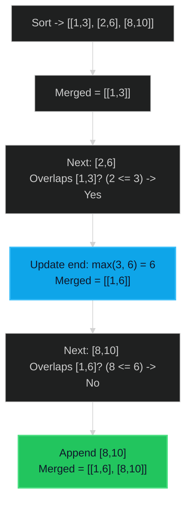

# Merge Intervals 🟡 Medium

**Tags**: `Array`, `Sorting`

## Prerequisite Topics

| Topic | Difficulty | Relevance | Notes |
|-------|-----------|-----------|-------|
| Sorting | 🟢 Easy | **Critical** | Sorting by start time enables single-pass merge |
| Array Iteration | 🟢 Easy | High | Processing intervals sequentially |

## The Challenge

Given an array of `intervals` where `intervals[i] = [start_i, end_i]`, merge all overlapping intervals, and return an array of the non-overlapping intervals that cover all the intervals in the input.

**Constraints**:
- $1 \leq intervals.length \leq 10^4$
- $intervals[i].length == 2$
- $0 \leq start_i \leq end_i \leq 10^4$

**Example**:
```python
Input: intervals = [[1,3],[2,6],[8,10],[15,18]]
Output: [[1,6],[8,10],[15,18]]
Explanation: Intervals [1,3] and [2,6] overlap, so they merge into [1,6].
```

## Algorithmic Analysis

### Naive Approach
Check every interval against every other interval.
- **Complexity**: $O(N^2)$.
- **Issues**: Handling complex multi-way overlaps (e.g., `[1,4], [2,5], [3,6]`) is messy without sorting.

### Optimal Approach (Sorting)
Sort intervals by their **start time**.
- **Intuition**: If we sort by start times, overlapping intervals will be adjacent in the sorted list.
- **Algorithm**:
    1. Sort `intervals` by `start` time.
    2. Initialize `merged` list with the first interval.
    3. Iterate through remaining intervals:
        - If current interval `[c_start, c_end]` overlaps with last merged interval `[m_start, m_end]` (i.e., `c_start <= m_end`):
            - Merge them by updating `m_end = max(m_end, c_end)`.
        - Else (no overlap):
            - Add current interval to `merged`.
- **Why it works**: Since we processed in order of start times, we know `c_start >= m_start`. The only check needed is if `c_start` starts before `m_end` finishes.

## Complexity Analysis

| Dimension | Complexity | Justification |
|-----------|-----------|---------------|
| Time | $O(N \log N)$ | Dominated by sorting. The merge pass is $O(N)$. |
| Space | $O(N)$ | Storing sorted/merged output. In-place sort reduces aux space to $O(\log N)$ or $O(1)$. |

## Visual Walkthrough

Input: `[[1,3], [2,6], [8,10]]`



## Solution

```python
def merge(self, intervals: list[list[int]]) -> list[list[int]]:
    if not intervals:
        return []
    
    intervals.sort(key=lambda x: x[0])
    merged = []
    
    for interval in intervals:
        if not merged or merged[-1][1] < interval[0]:
            merged.append(interval)
        else:
            merged[-1][1] = max(merged[-1][1], interval[1])
            
    return merged
```
