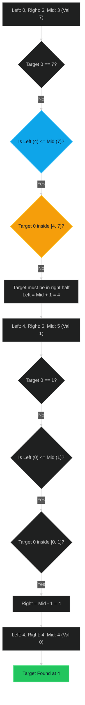

# Search in Rotated Sorted Array 🟡 Medium

**Tags**: `Array`, `Binary Search`

## Prerequisite Topics

| Topic | Difficulty | Relevance | Notes |
|-------|-----------|-----------|-------|
| Binary Search | 🟢 Easy | **Critical** | Core logic is modified binary search |
| Array Indexing | 🟢 Easy | High | Handling rotated indices |

## The Challenge

There is an integer array `nums` sorted in ascending order (with distinct values).

Prior to being passed to your function, `nums` is **rotated** at an unknown pivot index `k` ($1 \leq k < nums.length$) such that the resulting array is `[nums[k], nums[k+1], ..., nums[n-1], nums[0], nums[1], ..., nums[k-1]]`.

Given the array `nums` and an integer `target`, return the *index* of `target` if it is in `nums`, or `-1` if it is not.

You must write an algorithm with $O(\log n)$ runtime complexity.

**Constraints**:
- $1 \leq nums.length \leq 5000$
- $-10^4 \leq nums[i] \leq 10^4$
- All values of `nums` are **unique**.
- `nums` is an ascending array that is possibly rotated.

**Example**:
```python
Input: nums = [4,5,6,7,0,1,2], target = 0
Output: 4
```

## Algorithmic Analysis

### Naive Approach
Linear search through the list.
- **Complexity**: $O(N)$.
- **Issues**: Fails the $O(\log N)$ requirement.

### Optimal Approach (Modified Binary Search)
Even though the array is rotated, one half of the array (relative to the midpoint) will always be **sorted**.
- **Logic**:
    1. Calculate `mid`.
    2. Check if `nums[left] <= nums[mid]`.
        - If **True**: Left side `[left, mid]` is sorted.
            - Check if `target` is in range `[nums[left], nums[mid])`.
            - If yes, search left (`right = mid - 1`).
            - Else, search right (`left = mid + 1`).
        - If **False**: Right side `[mid, right]` is sorted.
            - Check if `target` is in range `(nums[mid], nums[right]]`.
            - If yes, search right (`left = mid + 1`).
            - Else, search left (`right = mid - 1`).
- **Key Insight**: We use the sorted half to determine if the target *could* be there. If not, we eliminate that half.

## Complexity Analysis

| Dimension | Complexity | Justification |
|-----------|-----------|---------------|
| Time | $O(\log N)$ | Standard binary search halving the search space. |
| Space | $O(1)$ | No extra storage needed. |

## Visual Walkthrough

Input: `[4, 5, 6, 7, 0, 1, 2]`, `Target = 0`



## Solution

```python
def search(self, nums: list[int], target: int) -> int:
    left, right = 0, len(nums) - 1
    
    while left <= right:
        mid = (left + right) // 2
        
        if nums[mid] == target:
            return mid
        
        # If left side is sorted
        if nums[left] <= nums[mid]:
            if nums[left] <= target < nums[mid]:
                right = mid - 1
            else:
                left = mid + 1
        # If right side is sorted
        else:
            if nums[mid] < target <= nums[right]:
                left = mid + 1
            else:
                right = mid - 1
                
    return -1
```
