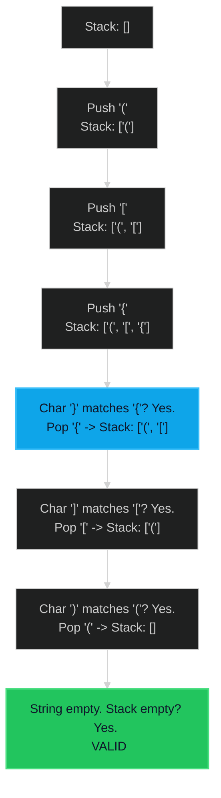

# Valid Parentheses 🟢 Easy

**Tags**: `Stack`, `String`

## Prerequisite Topics

| Topic | Difficulty | Relevance | Notes |
|-------|-----------|-----------|-------|
| Stack Operations | 🟢 Easy | **Critical** | Last-In-First-Out (LIFO) property is exact match for nested structures |
| String Iteration | 🟢 Easy | High | Processing chars one by one |

## The Challenge

Given a string `s` containing just the characters `'('`, `')'`, `'{'`, `'}'`, `'['` and `']'`, determine if the input string is valid.

An input string is valid if:
1. Open brackets must be closed by the same type of brackets.
2. Open brackets must be closed in the correct order.
3. Every close bracket has a corresponding open bracket of the same type.

**Constraints**:
- $1 \leq s.length \leq 10^4$
- `s` consists of parentheses only `()[]{}`.

**Example**:
```python
Input: s = "()[]{}"
Output: true

Input: s = "(]"
Output: false
```

## Algorithmic Analysis

### Naive Approach
Repeatedly replace innermost valid pairs `()` `[]` `{}` with empty strings until string is empty or no changes occur.
- **Complexity**: $O(N^2)$ due to repeated string modification and scanning.
- **Issues**: String manipulation is expensive.

### Optimal Approach (Stack)
Use a Stack to keep track of opening brackets.
- **Why Stack?**: The last opening bracket *must* be the first one closed (LIFO).
- **Algorithm**:
    1. Initialize empty `stack`.
    2. Map closing brackets to opening ones: `} -> {`.
    3. Iterate through `s`:
        - If `char` is an opening bracket: Push to `stack`.
        - If `char` is a closing bracket:
            - Check if `stack` is empty (invalid).
            - Pop from `stack`. If popped char doesn't match mapping, return `False`.
    4. After loop, return `True` if `stack` is empty (all opened were closed), else `False`.

## Complexity Analysis

| Dimension | Complexity | Justification |
|-----------|-----------|---------------|
| Time | $O(N)$ | Single pass through the string. Push/Pop are $O(1)$. |
| Space | $O(N)$ | In worst case (`((((`), stack stores all chars. |

## Visual Walkthrough

Input: `([{}])`



## Solution

```python
def is_valid_parentheses(self, s: str) -> bool:
    stack = []
    mapping = {")": "(", "}": "{", "]": "["}
    
    for char in s:
        if char in mapping:
            top_element = stack.pop() if stack else '#'
            if mapping[char] != top_element:
                return False
        else:
            stack.append(char)
            
    return not stack
```
