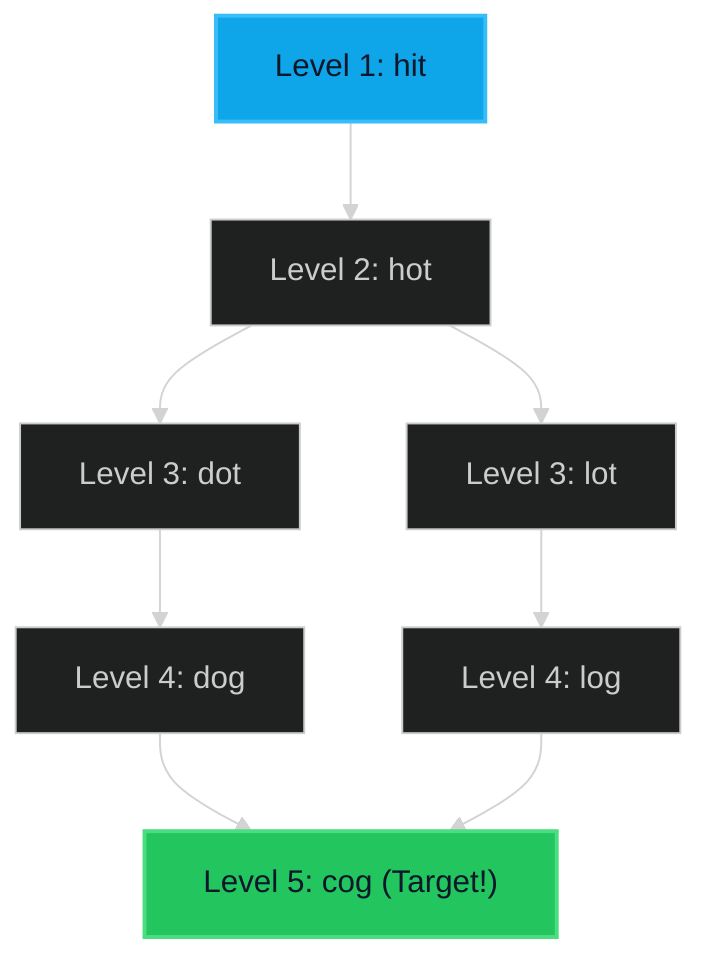

# Word Ladder 🔴 Hard

**Tags**: `Breadth-First Search`, `Strng`, `Hash Table`

## Prerequisite Topics

| Topic | Difficulty | Relevance | Notes |
|-------|-----------|-----------|-------|
| Breadth-First Search | 🟡 Medium | **Critical** | Shortest path in unweighted graph = BFS |
| Hash Set | 🟢 Easy | High | O(1) lookups for word existence |

## The Challenge

A **transformation sequence** from `beginWord` to `endWord` is a sequence of words `beginWord -> s1 -> s2 -> ... -> sk` such that:
1. Every adjacent pair of words differs by a single letter.
2. Every `si` for `1 <= i <= k` is in `wordList`. Note that `beginWord` does not need to be in `wordList`.
3. `sk == endWord`.

Given `beginWord`, `endWord`, and a dictionary `wordList`, return the *number of words* in the **shortest transformation sequence** from `beginWord` to `endWord`, or `0` if no such sequence exists.

**Constraints**:
- $1 \leq beginWord.length \leq 10$
- $1 \leq wordList.length \leq 5000$
- All words typically lowercase English letters.

**Example**:
```python
Input: beginWord = "hit", endWord = "cog", wordList = ["hot","dot","dog","lot","log","cog"]
Output: 5
Explanation: "hit" -> "hot" -> "dot" -> "dog" -> "cog"
```

## Algorithmic Analysis

### Naive Approach (DFS)
Try every path recursively.
- **Issues**: Finds *a* path, not necessarily the *shortest*. Can get stuck in cycles (needs visited set). Extremely slow for shortest path.

### Optimal Approach (BFS)
Treat words as nodes in a graph. An edge exists if words differ by 1 char. Find shortest path from Start to End.
- **Strategy**:
    1. Push `(beginWord, 1)` to Queue.
    2. Maintain `visited` set to avoid loops.
    3. While Queue not empty:
        - Pop `current_word`.
        - Generate all possible next words (change 1 char A-Z).
        - If neighbor is in `wordList` and not visited:
            - If neighbor == `endWord`, return `level + 1`.
            - Add to Queue, Mark visited.
- **Optimization**: Instead of checking every word in `wordList` (O(N * M)), generate all 26*M variations and check set existence (O(26 * M)). Since M is small (<= 10), this is faster.

## Complexity Analysis

| Dimension | Complexity | Justification |
|-----------|-----------|---------------|
| Time | $O(M^2 \times N)$ | $M$ = word len, $N$ = list size. We process each word, and for each char, gen 26 vars. String creation is $O(M)$. |
| Space | $O(M \times N)$ | To store `visited` and Queue. |

## Visual Walkthrough

Start: `hit`. Target: `cog`.



## Solution

```python
def ladder_length(self, begin_word: str, end_word: str, word_list: list[str]) -> int:
    word_set = set(word_list)
    if end_word not in word_set:
        return 0
    
    queue = deque([(begin_word, 1)])
    visited = set([begin_word])
    
    while queue:
        current_word, level = queue.popleft()
        
        if current_word == end_word:
            return level
        
        for i in range(len(current_word)):
            original_char = current_word[i]
            for c in range(ord('a'), ord('z') + 1):
                char = chr(c)
                if char == original_char: continue
                    
                new_word = current_word[:i] + char + current_word[i+1:]
                if new_word in word_set and new_word not in visited:
                    visited.add(new_word)
                    queue.append((new_word, level + 1))
                    
    return 0
```
