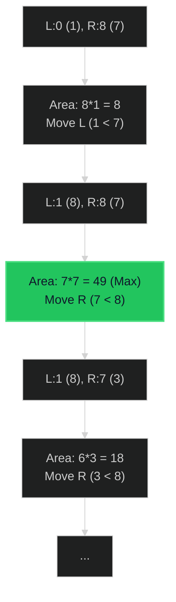

# Container With Most Water 🟡 Medium

**Tags**: `Array`, `Two Pointers`, `Greedy`

## Prerequisite Topics

| Topic | Difficulty | Relevance | Notes |
|-------|-----------|-----------|-------|
| Two Pointers | 🟢 Easy | **Critical** | Moving from both ends |
| Greedy Strategy | 🟡 Medium | High | Making local optimal choice |

## The Challenge

You are given an integer array `height` of length `n`. There are `n` vertical lines drawn such that the two endpoints of the $i^{th}$ line are `(i, 0)` and `(i, height[i])`.

Find two lines that together with the x-axis form a container, such that the container contains the most water.

Return the *maximum amount of water* a container can store.

**Constraints**:
- $n == height.length$
- $2 \leq n \leq 10^5$
- $0 \leq height[i] \leq 10^4$

**Example**:
```python
Input: height = [1,8,6,2,5,4,8,3,7]
Output: 49
Explanation: The max area is between index 1 (height 8) and index 8 (height 7). 
Width = 8 - 1 = 7. Height = min(8, 7) = 7. Area = 7 * 7 = 49.
```

## Algorithmic Analysis

### Naive Approach
Check every pair of lines.
- **Complexity**: $O(N^2)$.
- **Fail**: TLE for $N=10^5$.

### Optimal Approach (Two Pointers)
Start with the widest possible container (indices `0` and `N-1`) and shrink inwards.
- **Key Insight**: The area is determined by the *shorter* wall. 
    - `Area = (right - left) * min(height[left], height[right])`.
- **Strategy**:
    1. Initialize `left=0`, `right=N-1`.
    2. Calc area, update max.
    3. To potentially find a bigger area, we must find a higher wall. 
    4. **Greedy Choice**: Move the pointer pointing to the *shorter* wall. 
        - Why? Moving the taller wall can ONLY reduce area (width decreases, height is still limited by the short wall).
        - Moving the shorter wall gives a chance to find a taller one.
    5. Repeat until pointers meet.

## Complexity Analysis

| Dimension | Complexity | Justification |
|-----------|-----------|---------------|
| Time | $O(N)$ | Single pass from ends to center. |
| Space | $O(1)$ | Constant extra space. |

## Visual Walkthrough

Input: `[1, 8, 6, 2, 5, 4, 8, 3, 7]`



## Solution

```python
def max_area(self, height: list[int]) -> int:
    left, right = 0, len(height) - 1
    max_water = 0
    
    while left < right:
        width = right - left
        current_height = min(height[left], height[right])
        max_water = max(max_water, width * current_height)
        
        if height[left] < height[right]:
            left += 1
        else:
            right -= 1
            
    return max_water
```
