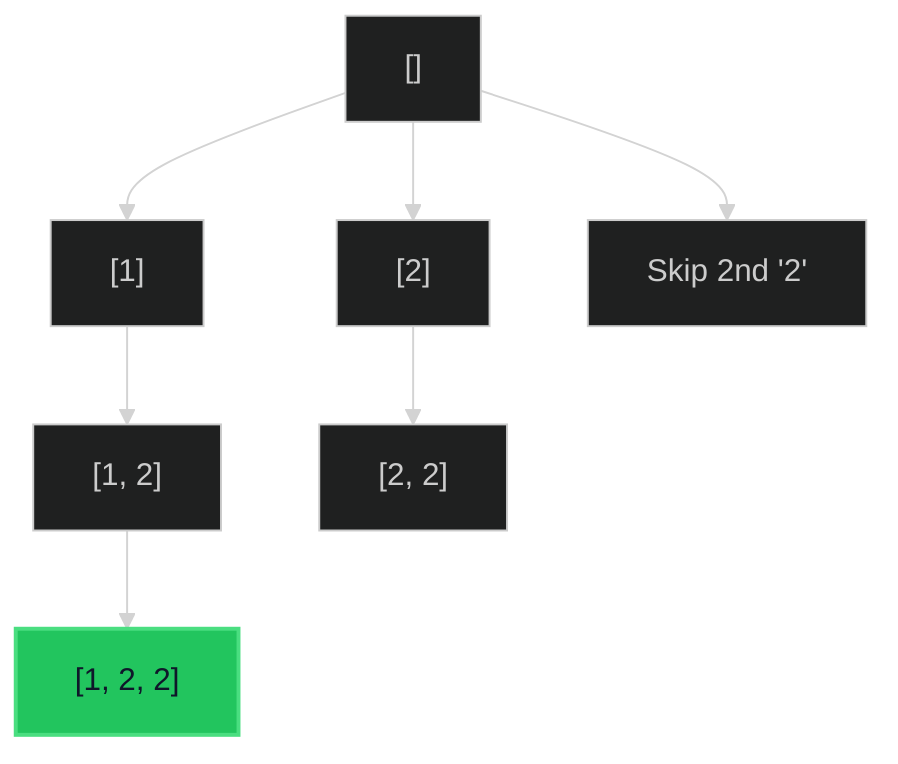

# Subset Sum II 🟡 Medium

**Tags**: `Backtracking`, `Array`, `Bit Manipulation`

## Prerequisite Topics

| Topic | Difficulty | Relevance | Notes |
|-------|-----------|-----------|-------|
| Backtracking | 🟡 Medium | **Critical** | Generating power set |
| Sorting | 🟢 Easy | High | Handling duplicates requires sorted input |

## The Challenge

Given an integer array `nums` that may contain duplicates, return *all possible subsets* (the power set).

The solution set **must not** contain duplicate subsets. Return the solution in any order.

**Constraints**:
- $1 \leq nums.length \leq 10$
- $-10 \leq nums[i] \leq 10$

**Example**:
```python
Input: nums = [1,2,2]
Output: [[],[1],[1,2],[1,2,2],[2],[2,2]]
```

## Algorithmic Analysis

### Naive Approach
Generate all $2^N$ subsets and use a `Set` of tuples to filter duplicates.
- **Issues**: Requires converting lists to tuples for hashing.

### Optimal Approach (Backtracking with Pruning)
Sort the array first to handle duplicates efficiently during generation.
- **Logic**:
    - Sort `nums`.
    - Function `backtrack(start, current_subset)`:
        - Add `current_subset` to results.
        - Loop `i` from `start` to `len(nums)`:
            - **Skip Duplicates**: If `i > start` and `nums[i] == nums[i-1]`, continue. This prevents processing the same number at the same "level" of the tree twice.
            - Include `nums[i]`.
            - Recurse `backtrack(i + 1, ...)`.
            - Exclude (pop) `nums[i]`.

## Complexity Analysis

| Dimension | Complexity | Justification |
|-----------|-----------|---------------|
| Time | $O(N \times 2^N)$ | $2^N$ subsets. Copying each takes $O(N)$. |
| Space | $O(N)$ | Recursion stack depth is $N$. |

## Visual Walkthrough

Input: `[1, 2, 2]`



## Solution

```python
def subsets_with_dup(self, nums: list[int]) -> list[list[int]]:
    results = []
    nums.sort()
    
    def backtrack(start_index: int, current_subset: list[int]):
        results.append(list(current_subset))
        
        for i in range(start_index, len(nums)):
            if i > start_index and nums[i] == nums[i - 1]:
                continue
            
            current_subset.append(nums[i])
            backtrack(i + 1, current_subset)
            current_subset.pop()
            
    backtrack(0, [])
    return results
```
