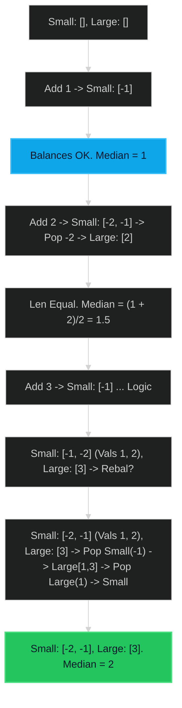

# Find Median from Data Stream 🔴 Hard

**Tags**: `Heap`, `Design`, `Data Stream`

## Prerequisite Topics

| Topic | Difficulty | Relevance | Notes |
|-------|-----------|-----------|-------|
| Priority Queue (Heap) | 🟡 Medium | **Critical** | Maintaining sorted halves efficienty |
| Object-Oriented Design | 🟢 Easy | High | Class structure |

## The Challenge

The **median** is the middle value in an ordered integer list. If the size of the list is even, there is no middle value, and the median is the mean of the two middle values.

Implement the `MedianFinder` class:
- `MedianFinder()` initializes the `MedianFinder` object.
- `void addNum(int num)` adds the integer `num` from the data stream to the data structure.
- `double findMedian()` returns the median of all elements so far.

**Constraints**:
- $-10^5 \leq num \leq 10^5$
- There will be at least one element in the data structure before calling `findMedian`.
- At most $5 \times 10^4$ calls will be made to `addNum` and `findMedian`.

**Example**:
```python
mf = MedianFinder()
mf.addNum(1)    # arr = [1]
mf.addNum(2)    # arr = [1, 2]
mf.findMedian() # return 1.5 ((1 + 2) / 2)
mf.addNum(3)    # arr = [1, 2, 3]
mf.findMedian() # return 2.0
```

## Algorithmic Analysis

### Naive Approach (Sorting)
Store list and sort it every time `findMedian` is called.
- **Complexity**: $O(N \log N)$ per find. With $N$ calls, total $O(N^2 \log N)$.
- **Improvements**: Insertion Sort ($O(N)$ insertion).

### Optimal Approach (Two Heaps)
Maintain two halves of the data:
1. **Small Half**: Stores the smaller numbers. We need the *largest* of these. -> **Max-Heap**.
2. **Large Half**: Stores the larger numbers. We need the *smallest* of these. -> **Min-Heap**.

- **Invariants**:
    1. Size balance: `len(small) == len(large)` (even total) or `len(small) == len(large) + 1` (odd total).
    2. Order property: `max(small) <= min(large)`.

- **Add Logic**:
    - Push to `small` (invert sign for min-heap implementation).
    - Pop from `small`, push to `large` (ensures order property).
    - If `large` is bigger than `small`, pop `large`, push `small`.

- **Find Logic**:
    - If `len(small) > len(large)`, median is `small.top`.
    - Else, median is `(small.top + large.top) / 2`.

## Complexity Analysis

| Dimension | Complexity | Justification |
|-----------|-----------|---------------|
| Time (Add) | $O(\log N)$ | Heap push/pop. |
| Time (Find) | $O(1)$ | Top of heaps access. |
| Space | $O(N)$ | Storing all elements. |

## Visual Walkthrough

Input: `[1, 2, 3]`



## Solution

```python
class MedianFinder:
    def __init__(self):
        self.small = []  # Max-heap (inverted)
        self.large = []  # Min-heap

    def add_num(self, num: int) -> None:
        heapq.heappush(self.small, -num)
        
        # Ensure order
        if self.small and self.large and (-self.small[0] > self.large[0]):
            val = -heapq.heappop(self.small)
            heapq.heappush(self.large, val)
            
        # Ensure balance
        if len(self.small) > len(self.large) + 1:
            val = -heapq.heappop(self.small)
            heapq.heappush(self.large, val)
        if len(self.large) > len(self.small):
            val = heapq.heappop(self.large)
            heapq.heappush(self.small, -val)

    def find_median(self) -> float:
        if len(self.small) > len(self.large):
            return float(-self.small[0])
        return (-self.small[0] + self.large[0]) / 2.0
```
