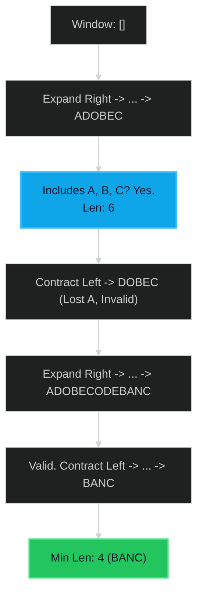

# Minimum Window Substring 🔴 Hard

**Tags**: `Sliding Window`, `Hash Table`, `String`

## Prerequisite Topics

| Topic | Difficulty | Relevance | Notes |
|-------|-----------|-----------|-------|
| Sliding Window | 🟡 Medium | **Critical** | Variable size window contraction |
| Hash Map (Frequency) | 🟢 Easy | High | Tracking character counts |

## The Challenge

Given two strings `s` and `t` of lengths `m` and `n` respectively, return the **minimum window substring** of `s` such that every character in `t` (including duplicates) is included in the window. If there is no such substring, return the empty string `""`.

The testcases will be generated such that the answer is unique.

**Constraints**:
- $m == s.length$
- $n == t.length$
- $1 \leq m, n \leq 10^5$
- `s` and `t` consist of uppercase and lowercase English letters.

**Example**:
```python
Input: s = "ADOBECODEBANC", t = "ABC"
Output: "BANC"
Explanation: The minimum window substring "BANC" includes 'A', 'B', and 'C'.
```

## Algorithmic Analysis

### Naive Approach
Check all substrings of `s`.
- **Complexity**: $O(N^3)$ or $O(N^2)$.
- **Fail**: TLE.

### Optimal Approach (Sliding Window)
Expand `right` to satisfy `t`. Once valid, contract `left` to minimize.
- **Logic**:
    1. Count chars in `t` -> `dict_t`.
    2. `required = len(dict_t)`.
    3. Expand `right`. Add `s[right]` to `window_counts`.
    4. If conditions for a char met (`window[c] == t[c]`), `formed++`.
    5. While `formed == required` (VALID WINDOW):
        - Update `min_len`, `ans`.
        - Remove `s[left]`. If count drops below required, `formed--`.
        - `left++`.

## Complexity Analysis

| Dimension | Complexity | Justification |
|-----------|-----------|---------------|
| Time | $O(S + T)$ | Process each char in `s` at most twice (add/remove). |
| Space | $O(1)$ | Hash map size limited by charset (128 chars). |

## Visual Walkthrough

Input: `s="ADOBECODEBANC", t="ABC"`



## Solution

```python
def min_window(self, s: str, t: str) -> str:
    if not t or not s: return ""
    dict_t = {}
    for char in t: dict_t[char] = dict_t.get(char, 0) + 1
    required = len(dict_t)
    l, r, formed = 0, 0, 0
    window_counts = {}
    ans = float("inf"), None, None

    while r < len(s):
        char = s[r]
        window_counts[char] = window_counts.get(char, 0) + 1
        if char in dict_t and window_counts[char] == dict_t[char]:
            formed += 1

        while l <= r and formed == required:
            char = s[l]
            if r - l + 1 < ans[0]:
                ans = (r - l + 1, l, r)
            window_counts[char] -= 1
            if char in dict_t and window_counts[char] < dict_t[char]:
                formed -= 1
            l += 1    
        r += 1
    return "" if ans[0] == float("inf") else s[ans[1] : ans[2] + 1]
```
