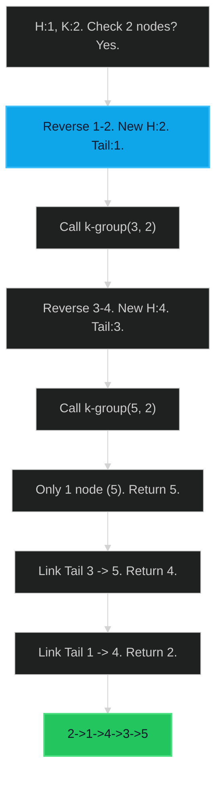

# Reverse Nodes in k-Group 🔴 Hard

**Tags**: `Linked List`, `Recursion`

## Prerequisite Topics

| Topic | Difficulty | Relevance | Notes |
|-------|-----------|-----------|-------|
| Linked List Reversal | 🟢 Easy | **Critical** | Standard reversal logic needed |
| Recursion | 🟡 Medium | High | Simplifies processing subsequent groups |

## The Challenge

Given the head of a linked list, reverse the nodes of the list `k` at a time, and return the modified list.

`k` is a positive integer and is less than or equal to the length of the linked list. If the number of nodes is not a multiple of `k` then left-out nodes, in the end, should remain as it is.

You may not alter the values in the list's nodes, only nodes themselves may be changed.

**Constraints**:
- Number of nodes in list is in range $[0, 5000]$.
- $0 \leq Node.val \leq 1000$
- $1 \leq k \leq length$

**Example**:
```python
Input: head = [1,2,3,4,5], k = 2
Output: [2,1,4,3,5]
```

## Algorithmic Analysis

### Naive Approach
Store in array, reverse chunks, rebuild list.
- **Space**: $O(N)$ (not allowed, usually O(1) expected).

### Optimal Approach (Iterative/Recursive)
Process `k` nodes at a time.
- **Logic**:
    1. Check if `k` nodes exist from current head. If not, return head (don't reverse).
    2. Reverse the first `k` nodes.
    3. The original head is now the *tail* of this group.
    4. Recursively call `reverse_k_group` on the next segment.
    5. Link the new tail (original head) to the result of recursion.
    6. Return the new head (original kth node).

## Complexity Analysis

| Dimension | Complexity | Justification |
|-----------|-----------|---------------|
| Time | $O(N)$ | Each node touched twice (check exist, then reverse). |
| Space | $O(1)$ | Iterative. Recursive uses $O(N/K)$ stack. |

## Visual Walkthrough

Input: `1->2->3->4->5`, `k=2`



## Solution

```python
def reverse_k_group(self, head: ListNode | None, k: int) -> ListNode | None:
    if not head or k == 1:
        return head

    curr = head
    count = 0
    while curr and count < k:
        curr = curr.next
        count += 1
    
    if count < k:
        return head
    
    prev = None
    curr = head
    for _ in range(k):
        next_node = curr.next
        curr.next = prev
        prev = curr
        curr = next_node
        
    if head:
        head.next = self.reverse_k_group(curr, k)
        
    return prev
```
