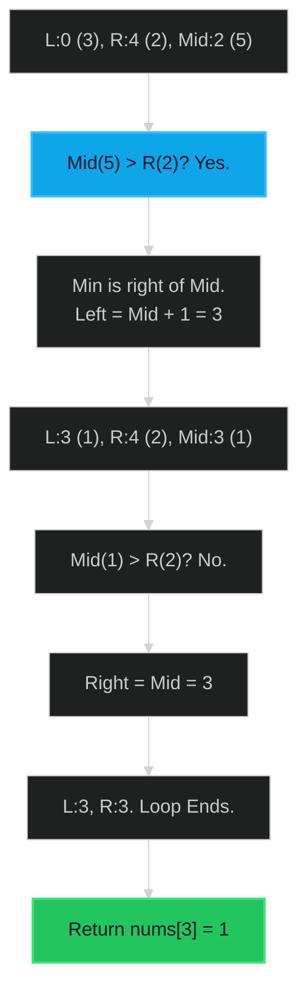

# Find Minimum in Rotated Sorted Array 🟡 Medium

**Tags**: `Array`, `Binary Search`

## Prerequisite Topics

| Topic | Difficulty | Relevance | Notes |
|-------|-----------|-----------|-------|
| Binary Search | 🟢 Easy | **Critical** | Identifying the inflection point |

## The Challenge

Suppose an array of length `n` sorted in ascending order is rotated between `1` and `n` times. For example, the array `nums = [0,1,2,4,5,6,7]` might become:
- `[4,5,6,7,0,1,2]` if it was rotated 4 times.
- `[0,1,2,4,5,6,7]` if it was rotated 7 times.

Notice that rotating an array `[a[0], a[1], a[2], ..., a[n-1]]` 1 time results in the array `[a[n-1], a[0], a[1], a[2], ..., a[n-2]]`.

Given the sorted rotated array `nums` of unique elements, return *the minimum element of this array*.

You must write an algorithm that runs in $O(\log n)$ time.

**Constraints**:
- $n == nums.length$
- $1 \leq n \leq 5000$
- $-5000 \leq nums[i] \leq 5000$
- All integers in `nums` are unique.

**Example**:
```python
Input: nums = [3,4,5,1,2]
Output: 1
```

## Algorithmic Analysis

### Naive Approach
Linear scan.
- **Complexity**: $O(N)$.
- **Fail**: Does not meet $O(\log N)$ constraint.

### Optimal Approach (Binary Search)
Find the point where order breaks ($nums[i] > nums[i+1]$).
- **Logic**:
    - `left`, `right`.
    - Loop while `left < right`:
        - `mid = (left + right) // 2`.
        - If `nums[mid] > nums[right]`: 
            - Mid is part of the left ascending chunk (large values).
            - Minimum must be to the **right** (pivot is in right half).
            - `left = mid + 1`.
        - Else (`nums[mid] <= nums[right]`):
            - Mid is part of the right ascending chunk (small values) OR array is not rotated.
            - Minimum is at `mid` or to the **left**.
            - `right = mid` (NOT `mid - 1` because mid could be the min).
    - Return `nums[left]`.

## Complexity Analysis

| Dimension | Complexity | Justification |
|-----------|-----------|---------------|
| Time | $O(\log N)$ | Standard binary search. |
| Space | $O(1)$ | No extra space. |

## Visual Walkthrough

Input: `[3, 4, 5, 1, 2]`



## Solution

```python
def find_min(self, nums: list[int]) -> int:
    left, right = 0, len(nums) - 1
    
    if nums[left] <= nums[right]:
        return nums[left]
    
    while left < right:
        mid = (left + right) // 2
        
        if nums[mid] > nums[right]:
            left = mid + 1
        else:
            right = mid
            
    return nums[left]
```
