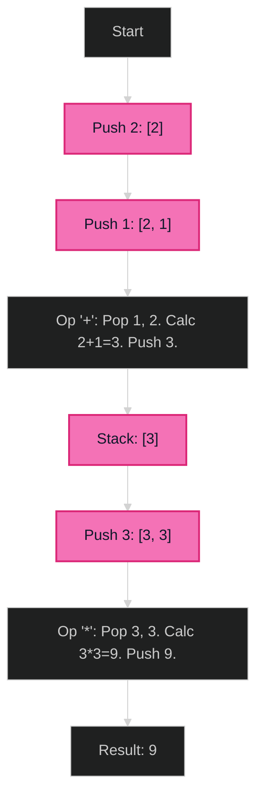

# Evaluate Reverse Polish Notation 🟡 Medium

**Tags**: `Stack`, `Math`

## Prerequisite Topics

| Topic | Difficulty | Relevance | Notes |
|-------|-----------|-----------|-------|
| Stack Operations | 🟢 Easy | **Critical** | Operand storage |

## The Challenge

Evaluate the value of an arithmetic expression in Reverse Polish Notation. Valid operators are `+`, `-`, `*`, and `/`. Each operand may be an integer or another expression. Division between two integers should truncate toward zero.

**Constraints**:
- $1 \leq tokens.length \leq 10^4$
- tokens[i] is an operator or integer.

**Example**:
```python
Input: tokens = ["2","1","+","3","*"]
Output: 9
Explanation: ((2 + 1) * 3) = 9
```

## Algorithmic Analysis

### Optimal Approach (Stack)
Standard RPN evaluation.
- **Logic**:
    - If number: Push to stack.
    - If operator: Pop two numbers (`b` then `a`), Apply op `a <op> b`, Push result.
- **Note**: For division `/`, Python's `//` works like floor. Use `int(a / b)` for truncate toward zero (e.g., `6 / -132` -> `0`).

### Strategic Analysis & Real-World Context

> [!NOTE]
> **Why this matters**: Compilers (AST code generation), Postscript (PDFs), Early HP Calculators.

| Scenario | Preferred Approach | Why? |
|----------|--------------------|------|
| **Standard** | **Stack** | $O(N)$ Time. Natural fit for RPN. |

## Complexity Analysis

| Dimension | Complexity | Justification |
|-----------|-----------|---------------|
| Time | $O(N)$ | Process each token once. |
| Space | $O(N)$ | Stack depth. |

## Visual Walkthrough

`["2", "1", "+", "3", "*"]`



## Solution

```python
def eval_rpn(self, tokens: list[str]) -> int:
    stack = []
    for token in tokens:
        if token in "+-*/":
            b = stack.pop()
            a = stack.pop()
            if token == "+": stack.append(a + b)
            elif token == "-": stack.append(a - b)
            elif token == "*": stack.append(a * b)
            elif token == "/": stack.append(int(a / b))
        else:
            stack.append(int(token))
    return stack[0]
```
