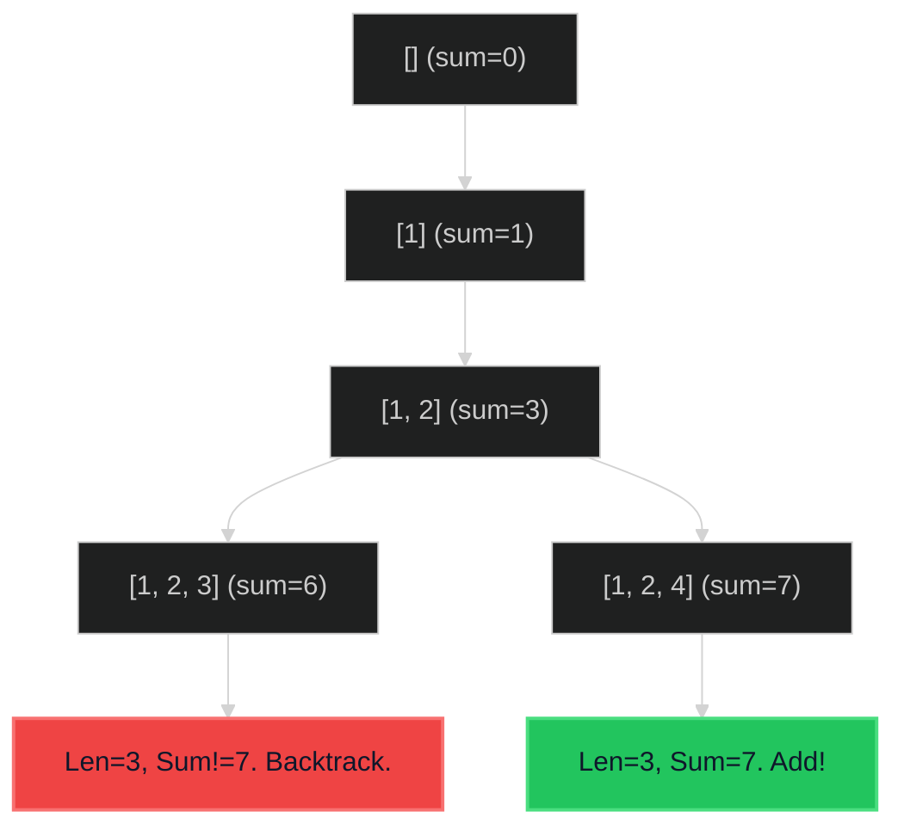

# Combination Sum III 🟡 Medium

**Tags**: `Backtracking`, `Array`

## Prerequisite Topics

| Topic | Difficulty | Relevance | Notes |
|-------|-----------|-----------|-------|
| Recursion (Backtracking) | 🟡 Medium | **Critical** | Exploring combinations |

## The Challenge

Find all valid combinations of `k` numbers that sum up to `n` such that the following conditions are true:
- Only numbers 1 through 9 are used.
- Each number is used at most once.

**Constraints**:
- $2 \leq k \leq 9$
- $1 \leq n \leq 60$

**Example**:
```python
Input: k = 3, n = 7
Output: [[1,2,4]]
```

## Algorithmic Analysis

### Optimal Approach (Backtracking)
Explore subset logic.
- **State**: `(start_num, current_comb, current_sum)`
- **Boundaries**:
    - If `len == k` and `sum == n`: Add to valid.
    - If `sum > n` or `len > k`: Prune.
- **Loop**: `i` from `start_num` to 9.

### Strategic Analysis & Real-World Context

> [!NOTE]
> **Why this matters**: Feature selection, Knapsack-like resource allocation.

| Scenario | Preferred Approach | Why? |
|----------|--------------------|------|
| **Small Range** | **Backtracking** | Input only 1-9. Search space is tiny ($2^9 = 512$ max). Very fast. |

## Complexity Analysis

| Dimension | Complexity | Justification |
|-----------|-----------|---------------|
| Time | $O(C(9, k))$ | Choosing k from 9 items. |
| Space | $O(k)$ | Recursion depth. |

## Visual Walkthrough

`k=3, n=7`



## Solution

```python
def combination_sum_3(self, k: int, n: int) -> list[list[int]]:
    results = []
    def backtrack(start: int, current_comb: list[int], current_sum: int):
        if len(current_comb) == k:
            if current_sum == n: results.append(list(current_comb))
            return
        if current_sum > n: return
        
        for i in range(start, 10):
            current_comb.append(i)
            backtrack(i + 1, current_comb, current_sum + i)
            current_comb.pop()
            
    backtrack(1, [], 0)
    return results
```
