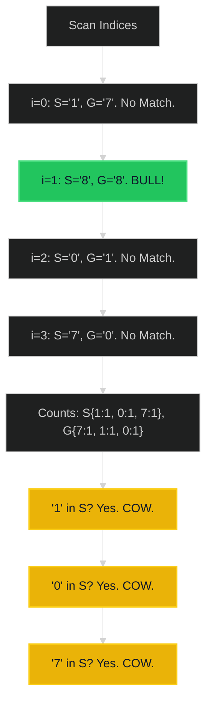

# Bulls and Cows 🟡 Medium

**Tags**: `Hash Table`, `String`, `Counting`

## Prerequisite Topics

| Topic | Difficulty | Relevance | Notes |
|-------|-----------|-----------|-------|
| Hash Map (Frequency) | 🟢 Easy | **Critical** | Counting chars |

## The Challenge

You are playing the **Bulls and Cows** game with your friend.

You write down a secret number and ask your friend to guess what the number is. When your friend makes a guess, you provide a hint with the following info:
- The number of "bulls", which are digits in the guess that are in the correct position.
- The number of "cows", which are digits in the guess that are in your secret number but are located in the wrong position.

Given the secret number `secret` and your friend's guess `guess`, return the hint to your friend's guess.

**Constraints**:
- $1 \leq secret.length, guess.length \leq 1000$
- `secret` and `guess` consist of digits.

**Example**:
```python
Input: secret = "1807", guess = "7810"
Output: "1A3B"
Explanation: 1 Bull (8), 3 Cows (0, 1, 7).
```

## Algorithmic Analysis

### Optimal Approach (Counter)
Two pass or One pass.
- **Logic**:
    1. **Bulls**: Scan `i`. If `secret[i] == guess[i]`: `bulls++`. Remove from consideration.
    2. **Cows**: Count remaining chars in secret and guess. For each char `c`, `cows += min(secret_count[c], guess_count[c])`.

### Strategic Analysis & Real-World Context

> [!NOTE]
> **Why this matters**: Code breaking games (Wordle logic), fuzzy matching scoring.

| Scenario | Preferred Approach | Why? |
|----------|--------------------|------|
| **Standard** | **Two Pass** | $O(N)$. Clear separation of Bulls vs Cows logic. |

## Complexity Analysis

| Dimension | Complexity | Justification |
|-----------|-----------|---------------|
| Time | $O(N)$ | Single/Double pass. |
| Space | $O(1)$ | Digits 0-9 counters (Size 10). |

## Visual Walkthrough

`S="1807", G="7810"`



## Solution

```python
def get_hint(self, secret: str, guess: str) -> str:
    bulls = 0
    cows = 0
    secret_counts = Counter(secret)
    guess_counts = Counter(guess)
    
    # Calculate Bulls
    for s, g in zip(secret, guess):
        if s == g:
            bulls += 1
            # Decrement counts so they aren't counted as cows
            secret_counts[s] -= 1
            guess_counts[g] -= 1
            
    # Calculate Cows
    for char, count in guess_counts.items():
        if char in secret_counts:
            # Cows is min of remaining available
            cows += min(count, secret_counts[char])
            
    return f"{bulls}A{cows}B"
```
