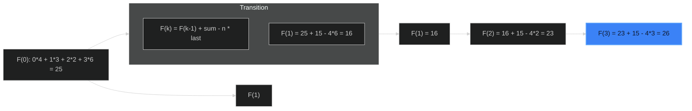

# Rotate Function 🟡 Medium

**Tags**: `Math`, `Array`, `Dynamic Programming`

## Prerequisite Topics

| Topic | Difficulty | Relevance | Notes |
|-------|-----------|-----------|-------|
| Mathematical Derivation | 🔴 Hard | **Critical** | Finding the recurrence relation |

## The Challenge

You are given an integer array `nums` of length `n`.

Assume `arr_k` to be an array obtained by rotating `nums` by `k` positions clock-wise. We define the rotation function `F` on `nums` as follows:

`F(k) = 0 * arr_k[0] + 1 * arr_k[1] + ... + (n - 1) * arr_k[n - 1]`

Return the *maximum value* of `F(0), F(1), ..., F(n-1)`.

**Constraints**:
- $n == nums.length$
- $1 \leq n \leq 10^5$

**Example**:
```python
Input: nums = [4,3,2,6]
Output: 26
```

## Algorithmic Analysis

### Naive Approach
Calculate F(k) for each k independently.
- **Complexity**: $O(N^2)$.
- **Fail**: TLE on $N=10^5$.

### Optimal Approach (Mathematical Pattern)
Derive $F(k)$ from $F(k-1)$.
- $F(0) = 0 \cdot A + 1 \cdot B + 2 \cdot C + 3 \cdot D$
- $F(1) = 0 \cdot D + 1 \cdot A + 2 \cdot B + 3 \cdot C$
- Difference: $F(1) - F(0) = A + B + C - 3D$
- Generalization: $F(k) = F(k-1) + \text{sum}(nums) - n \times \text{nums}[n-k]$
- **Explanation**: Every element shifts right (increasing coefficient by 1), except the last element which wraps to 0 (coefficient drops from $n-1$ to 0).

### Strategic Analysis & Real-World Context

> [!NOTE]
> **Why this matters**: Signal processing (convolution), sliding window calculations where window shifts cyclically.

| Scenario | Preferred Approach | Why? |
|----------|--------------------|------|
| **Standard** | **Math Derivation** | $O(N)$ Time. Reduces quadratic work to linear by finding pattern. |

## Complexity Analysis

| Dimension | Complexity | Justification |
|-----------|-----------|---------------|
| Time | $O(N)$ | One pass to calc F(0), one pass for others. |
| Space | $O(1)$ | Constant vars. |

## Visual Walkthrough

`nums = [4, 3, 2, 6]`



## Solution

```python
def rotate_function(self, nums: list[int]) -> int:
    n = len(nums)
    s = sum(nums)
    f_0 = sum(i * num for i, num in enumerate(nums))
    
    max_f = f_0
    current_f = f_0
    
    for k in range(1, n):
        # The element moving from end to start is nums[n-k]
        current_f = current_f + s - n * nums[n - k]
        max_f = max(max_f, current_f)
        
    return max_f
```
