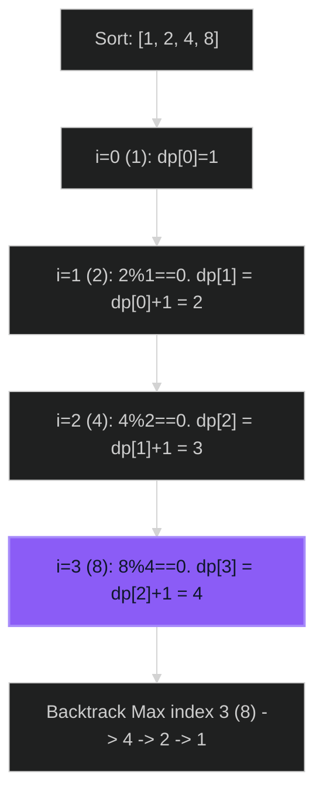

# Largest Divisible Subset 🟡 Medium

**Tags**: `Dynamic Programming`, `Sorting`, `Math`

## Prerequisite Topics

| Topic | Difficulty | Relevance | Notes |
|-------|-----------|-----------|-------|
| LIS (Longest Increasing Subsequence) | 🟡 Medium | **Critical** | Similar DP structure |
| Sorting | 🟢 Easy | High | Simples divisibility checks |

## The Challenge

Given a set of distinct positive integers `nums`, return the largest subset `answer` such that every pair `(answer[i], answer[j])` of elements in this subset satisfies:
- `answer[i] % answer[j] == 0`, or
- `answer[j] % answer[i] == 0`

**Constraints**:
- $1 \leq nums.length \leq 1000$

**Example**:
```python
Input: nums = [1,2,3]
Output: [1,2] (or [1,3])
```

## Algorithmic Analysis

### Optimal Approach (Sorting + DP)
If `a < b < c` and `b % a == 0` and `c % b == 0`, then `c % a == 0` (transitivity).
1. **Sort `nums`**: Ensures we only check `nums[i] % nums[j] == 0` for $j < i$.
2. **DP State**: `dp[i]` = size of largest divisible subset ending at index `i`.
3. **Transition**: $dp[i] = \max(dp[j] + 1)$ for all $j < i$ where `nums[i] % nums[j] == 0`.
4. **Reconstruction**: Track `prev[i]` to rebuild the subset.

### Strategic Analysis & Real-World Context

> [!NOTE]
> **Why this matters**: Resource scheduling (compatible time slots), Cryptography (coprime vs divisible keys).

| Scenario | Preferred Approach | Why? |
|----------|--------------------|------|
| **Standard** | **Sort + DP** | $O(N^2)$. Similar to LIS, but condition is modulo. |

## Complexity Analysis

| Dimension | Complexity | Justification |
|-----------|-----------|---------------|
| Time | $O(N^2)$ | Double loop for DP. |
| Space | $O(N)$ | DP array and Prev array. |

## Visual Walkthrough

`nums = [1, 2, 4, 8]`



## Solution

```python
def largest_divisible_subset(self, nums: list[int]) -> list[int]:
    if not nums: return []
    nums.sort()
    n = len(nums)
    dp = [1] * n
    prev = [-1] * n
    
    max_size = 1
    max_index = 0
    
    for i in range(1, n):
        for j in range(i):
            if nums[i] % nums[j] == 0:
                if dp[i] < dp[j] + 1:
                    dp[i] = dp[j] + 1
                    prev[i] = j
                    
        if dp[i] > max_size:
            max_size = dp[i]
            max_index = i
            
    result = []
    curr = max_index
    while curr != -1:
        result.append(nums[curr])
        curr = prev[curr]
        
    return result[::-1]
```
