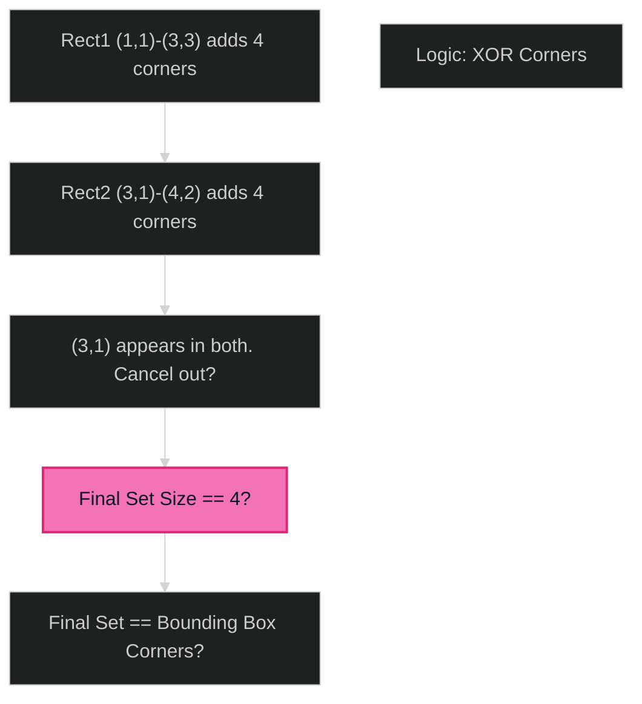

# Perfect Rectangle 🔴 Hard

**Tags**: `Geometry`, `Math`, `Sweep Line`

## Prerequisite Topics

| Topic | Difficulty | Relevance | Notes |
|-------|-----------|-----------|-------|
| Coordinate Geometry | 🟢 Easy | High | Bounding box logic |

## The Challenge

Given an array `rectangles` where `rectangles[i] = [x1, y1, x2, y2]`, return `true` if all the rectangles together form an exact rectangular region.

**Constraints**:
- $1 \leq rectangles.length \leq 2 \times 10^4$

**Example**:
```python
Input: rectangles = [[1,1,3,3],[3,1,4,2],[3,2,4,4],[1,3,2,4],[2,3,3,4]]
Output: true
```

## Algorithmic Analysis

### Naive Approach
Bitmap / Grid approximation. 
- **Fail**: Coordinates are huge (infinity).

### Optimal Approach (Area + Corners)
Two necessary and sufficient conditions:
1. **Area**: Sum of all areas equals area of bounding box ($MaxX - MinX \times MaxY - MinY$).
2. **Corners**:
    - All *inner* corners must overlap pairwise or quad-wise to cancel out.
    - Only the 4 outer corners of the bounding box should remain after cancellation.
    - We use a set to track corners. A corner is "odd" if it appears 1 or 3 times. We want exactly 4 corners with count 1 corresponding to the bounding box. (Usually simplified to XOR or Set toggle: if present remove, else add).

### Strategic Analysis & Real-World Context

> [!NOTE]
> **Why this matters**: VLSI Design (chip floorplanning), UI Window Managers.

| Scenario | Preferred Approach | Why? |
|----------|--------------------|------|
| **Standard** | **Corner Counting** | $O(N)$. Mathematically elegant and robust. |

## Complexity Analysis

| Dimension | Complexity | Justification |
|-----------|-----------|---------------|
| Time | $O(N)$ | Single pass. |
| Space | $O(N)$ | Corner set max size 4N. |

## Visual Walkthrough

`[[1,1,3,3], [3,1,4,2], ...]`



## Solution

```python
def is_rectangle_cover(self, rectangles: list[list[int]]) -> bool:
    area = 0
    corners = set()
    min_x, min_y = float('inf'), float('inf')
    max_x, max_y = float('-inf'), float('-inf')
    
    for x1, y1, x2, y2 in rectangles:
        area += (x2 - x1) * (y2 - y1)
        min_x, min_y = min(min_x, x1), min(min_y, y1)
        max_x, max_y = max(max_x, x2), max(max_y, y2)
        
        for p in [(x1, y1), (x1, y2), (x2, y1), (x2, y2)]:
            if p in corners: corners.remove(p)
            else: corners.add(p)
            
    if area != (max_x - min_x) * (max_y - min_y):
        return False
        
    return corners == {(min_x, min_y), (min_x, max_y), (max_x, min_y), (max_x, max_y)}
```
