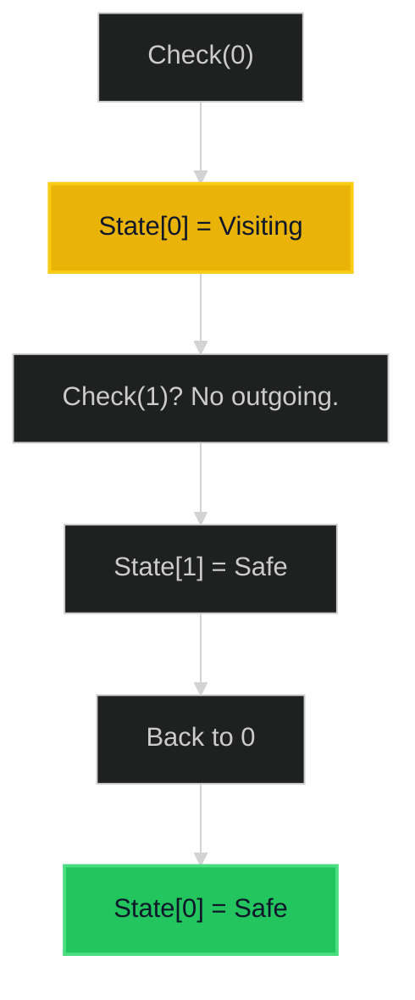

# Course Schedule 🟡 Medium

**Tags**: `Graph`, `DFS`, `Topological Sort`

## Prerequisite Topics

| Topic | Difficulty | Relevance | Notes |
|-------|-----------|-----------|-------|
| Directed Graphs | 🟢 Easy | **Critical** | Edges = Prerequisites |
| Cycle Detection | 🟡 Medium | **Critical** | Core logic |

## The Challenge

There are `numCourses` courses you have to take available. Some have prerequisites. Return `true` if you can finish all courses.

**Constraints**:
- $1 \leq numCourses \leq 2000$

**Example**:
```python
Input: numCourses = 2, prerequisites = [[1,0]]
Output: true (Take 0 then 1)
```

## Algorithmic Analysis

### Optimal Approach (DFS / Kahn's Algo)
Detect cycle in directed graph.
- **DFS**: 3-Coloring.
    - 0: Unvisited.
    - 1: Visiting (in current recursion stack).
    - 2: Visited (safe).
    - If valid node leads to 1, CYCLE detected.
- **Kahn's (BFS)**:
    - Track in-degrees.
    - Queue nodes with 0 in-degree.
    - If processed nodes < total, CYCLE exists.

### Strategic Analysis & Real-World Context

> [!NOTE]
> **Why this matters**: Package dependency managers (pip, npm), Build systems (Make), Task Scheduling.

| Scenario | Preferred Approach | Why? |
|----------|--------------------|------|
| **Standard** | **DFS** | $O(V+E)$. Easy to implement recursively. |
| **Need Order** | **Kahn's** | Naturally produces the topological sort list if valid. |

## Complexity Analysis

| Dimension | Complexity | Justification |
|-----------|-----------|---------------|
| Time | $O(V + E)$ | Visit every node and edge. |
| Space | $O(V + E)$ | Adjacency list + Recursion stack. |

## Visual Walkthrough

`2 courses, [[1,0]]`



## Solution

```python
def can_finish(self, num_courses: int, prerequisites: list[list[int]]) -> bool:
    adj = [[] for _ in range(num_courses)]
    for course, pre in prerequisites:
        adj[pre].append(course)
        
    state = [0] * num_courses
    
    def has_cycle(node):
        if state[node] == 1: return True
        if state[node] == 2: return False
        
        state[node] = 1
        for neighbor in adj[node]:
            if has_cycle(neighbor): return True
        state[node] = 2
        return False
        
    for i in range(num_courses):
        if has_cycle(i): return False
    return True
```
