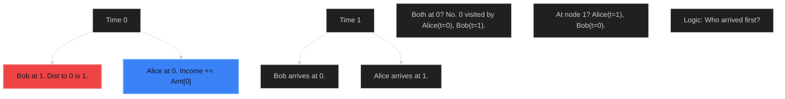

# Most Profitable Path in a Tree 🟡 Medium

**Tags**: `Tree`, `DFS`, `BFS`

## Prerequisite Topics

| Topic | Difficulty | Relevance | Notes |
|-------|-----------|-----------|-------|
| Graph Traversal | 🟢 Easy | **Critical** | Finding paths and arrival times |

## The Challenge

Alice starts at 0, Bob starts at `bob` node.
- Alice moves to a leaf node to max net income.
- Bob moves to 0.
- `amount[i]` is cost (neg) or reward (pos).
- If they reach node same time, split cost/reward.
- If one arrives earlier, they take/pay full.
Return max net income for Alice.

**Constraints**:
- $2 \leq n \leq 10^5$

## Algorithmic Analysis

### Optimal Approach (Two Pass)
1. **Map Bob**: Find Bob's path to 0 using DFS/BFS. Record `arrival_time[node]` for Bob.
2. **Alice Search**: DFS from 0 to leaves.
    - Track `curr_time` and `curr_income`.
    - At each node, check Bob's time vs Alice's time.
        - Alice < Bob: Alice gets full amount.
        - Alice == Bob: Split amount.
        - Alice > Bob: 0 amount (taken).
    - If Leaf, update global max.

### Strategic Analysis & Real-World Context

> [!NOTE]
> **Why this matters**: Game theory simulation, network routing with competitive interference.

## Complexity Analysis

| Dimension | Complexity | Justification |
|-----------|-----------|---------------|
| Time | $O(N)$ | Two traversals. |
| Space | $O(N)$ | Tree storage. |

## Visual Walkthrough

`Bob starts at 1, Alice at 0`



## Solution

```python
def most_profitable_path(self, edges: list[list[int]], bob: int, amount: list[int]) -> int:
    n = len(amount)
    adj = [[] for _ in range(n)]
    for u, v in edges:
        adj[u].append(v); adj[v].append(u)
        
    bob_time = {}
    def find_bob(node, time, visited):
        bob_time[node] = time
        if node == 0: return True
        visited.add(node)
        for nei in adj[node]:
            if nei not in visited:
                if find_bob(nei, time + 1, visited): return True
        del bob_time[node]
        return False
    find_bob(bob, 0, set())
    
    max_profit = float('-inf')
    visited = [False] * n
    def solve_alice(node, time, curr_profit):
        nonlocal max_profit
        visited[node] = True
        
        # Calculate Income
        inc = 0
        if node not in bob_time or time < bob_time[node]: inc = amount[node]
        elif time == bob_time[node]: inc = amount[node] // 2
        
        curr_profit += inc
        
        is_leaf = True
        for nei in adj[node]:
            if not visited[nei]:
                is_leaf = False
                solve_alice(nei, time + 1, curr_profit)
        
        if is_leaf: max_profit = max(max_profit, curr_profit)
        
    solve_alice(0, 0, 0)
    return int(max_profit)
```
