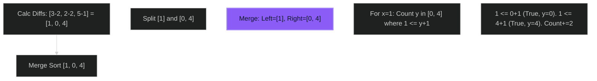

# Number of Pairs Satisfying Inequality 🔴 Hard

**Tags**: `Merge Sort`, `Segment Tree`, `BIT`

## Prerequisite Topics

| Topic | Difficulty | Relevance | Notes |
|-------|-----------|-----------|-------|
| Merge Sort | 🟡 Medium | **Critical** | Modified merge step |

## The Challenge

Given two 0-indexed integer arrays `nums1` and `nums2`, and an integer `diff`, return the number of pairs `(i, j)` such that:
- $0 \leq i < j \leq n - 1$
- $nums1[i] - nums1[j] \leq nums2[i] - nums2[j] + diff$

**Constraints**:
- $n == nums1.length == nums2.length$
- $2 \leq n \leq 10^5$

## Algorithmic Analysis

### Naive Approach
Check all pairs. $O(N^2)$.
- **Fail**: $N=10^5$ leads to TLE.

### Optimal Approach (Rearrangement + Merge Sort)
Rewrite inequality:
$(nums1[i] - nums2[i]) \leq (nums1[j] - nums2[j]) + diff$
Let $d[k] = nums1[k] - nums2[k]$.
Find pairs $(i, j)$ where $i < j$ and $d[i] \leq d[j] + diff$.
This is "Count Pairs with Condition" solvable via Merge Sort (like Inversion Count).
- During merge of `Left` and `Right`:
    - For element `x` in `Left`, count valid `y` in `Right`.
    - Since `Right` is sorted, we can find split point efficiently.

### Strategic Analysis & Real-World Context

> [!NOTE]
> **Why this matters**: Statistical analysis (rank correlation), specialized database joins.

## Complexity Analysis

| Dimension | Complexity | Justification |
|-----------|-----------|---------------|
| Time | $O(N \log N)$ | Merge sort. |
| Space | $O(N)$ | Merge sort auxiliary array. |

## Visual Walkthrough

`nums1=[3,2,5], nums2=[2,2,1], diff=1`



## Solution

```python
def number_of_pairs(self, nums1: list[int], nums2: list[int], diff: int) -> int:
    d = [n1 - n2 for n1, n2 in zip(nums1, nums2)]
    def merge_sort(arr):
        if len(arr) <= 1: return arr, 0
        mid = len(arr) // 2
        left, l_cnt = merge_sort(arr[:mid])
        right, r_cnt = merge_sort(arr[mid:])
        count = l_cnt + r_cnt
        
        # Count Step
        r_idx = 0
        for x in left:
            while r_idx < len(right) and right[r_idx] < x - diff:
                r_idx += 1
            count += len(right) - r_idx
            
        # Merge Step
        sorted_arr = []
        i = j = 0
        while i < len(left) and j < len(right):
            if left[i] <= right[j]:
                sorted_arr.append(left[i]); i += 1
            else:
                sorted_arr.append(right[j]); j += 1
        sorted_arr.extend(left[i:]); sorted_arr.extend(right[j:])
        return sorted_arr, count
        
    _, total = merge_sort(d)
    return total
```
