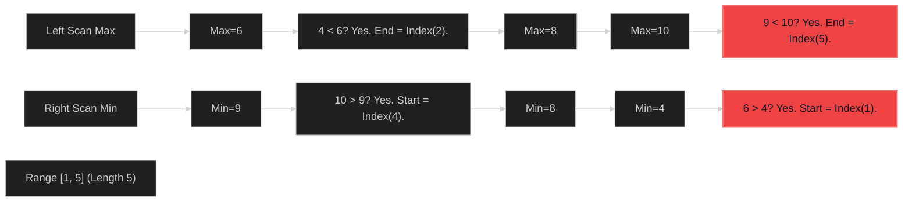

# Shortest Unsorted Continuous Subarray 🟡 Medium

**Tags**: `Array`, `Sorting`, `Two Pointers`

## Prerequisite Topics

| Topic | Difficulty | Relevance | Notes |
|-------|-----------|-----------|-------|
| Array Scanning | 🟢 Easy | **Critical** | Finding min/max out of order |

## The Challenge

Given an integer array `nums`, you need to find one continuous subarray that if you only sort this subarray in ascending order, then the whole array will be sorted in ascending order. Return the shortest such subarray and output its length.

**Constraints**:
- $1 \leq nums.length \leq 10^4$

**Example**:
```python
Input: nums = [2,6,4,8,10,9,15]
Output: 5
Explanation: [6, 4, 8, 10, 9] needs sorting.
```

## Algorithmic Analysis

### Naive Approach (Sorting)
Sort copy `s_nums`. Compare `nums[i] != s_nums[i]`. Find first and last mismatch.
- **Complexity**: $O(N \log N)$.
- **Space**: $O(N)$.

### Optimal Approach (One Pass)
1. Find the element from left that is smaller than `max_so_far`. This marks the `end` of disorder.
2. Find the element from right that is bigger than `min_so_far`. This marks the `start` of disorder.
- **Explanation**: If `nums[i]` is smaller than max on its left, it MUST be rearranged.

### Strategic Analysis & Real-World Context

> [!NOTE]
> **Why this matters**: Data cleaning (identifying corrupted segments), partially sorted data optimization.

| Scenario | Preferred Approach | Why? |
|----------|--------------------|------|
| **Standard** | **Two Pass** | $O(N)$. Linear time is optimal. |

## Complexity Analysis

| Dimension | Complexity | Justification |
|-----------|-----------|---------------|
| Time | $O(N)$ | Two linear scans. |
| Space | $O(1)$ | Constant variables. |

## Visual Walkthrough

`[2, 6, 4, 8, 10, 9, 15]`



## Solution

```python
def find_unsorted_subarray(self, nums: list[int]) -> int:
    n = len(nums)
    if n <= 1: return 0
    
    end = -2
    max_so_far = float('-inf')
    for i in range(n):
        max_so_far = max(max_so_far, nums[i])
        if nums[i] < max_so_far: end = i
            
    start = -1
    min_so_far = float('inf')
    for i in range(n - 1, -1, -1):
        min_so_far = min(min_so_far, nums[i])
        if nums[i] > min_so_far: start = i
            
    if end == -2: return 0
    return end - start + 1
```
