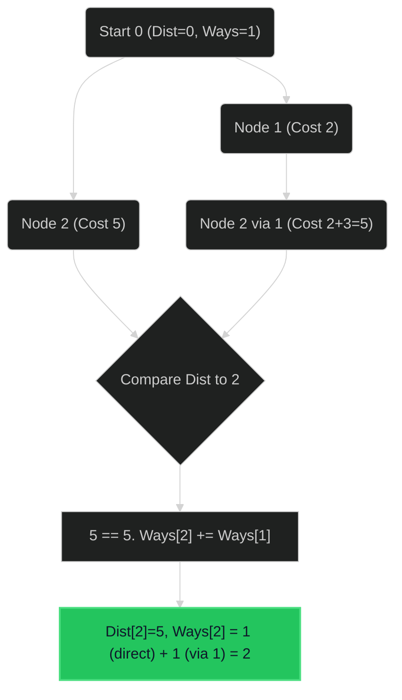

# Number of Ways to Arrive at Destination 🟡 Medium

**Tags**: `Graph`, `Dijkstra`, `Dynamic Programming`

## Prerequisite Topics

| Topic | Difficulty | Relevance | Notes |
|-------|-----------|-----------|-------|
| Dijkstra's Algo | 🟡 Medium | **Critical** | Shortest Path |
| Modular Arithmetic | 🟢 Easy | High | Result modulo $10^9+7$ |

## The Challenge

You are in a city that consists of `n` intersections numbered from `0` to `n - 1` with bi-directional roads between some intersections. The inputs are generated such that you can reach any intersection from any other intersection and that there is at most one road between any two intersections.

You want to know the number of ways you can travel from intersection `0` to intersection `n - 1` in the **shortest amount of time**.

**Constraints**:
- $1 \leq n \leq 200$
- $0 \leq time_i \leq 10^9$

**Example**:
```python
Input: n = 7, roads = [[0,6,7],[0,1,2],[1,2,3],[1,3,3],[6,3,3],[3,5,1],[6,5,1],[2,5,1],[0,4,5],[4,6,2]]
Output: 4
```

## Algorithmic Analysis

### Optimal Approach (Dijkstra + DP)
Standard Dijkstra finds the shortest time. We need to count *how many* paths match this time.
- `dist[v]`: Min time to reach `v`.
- `ways[v]`: Number of ways to reach `v` with time `dist[v]`.
- **Relaxation Logic**:
    - If `new_time < dist[v]`:
        - `dist[v] = new_time`
        - `ways[v] = ways[u]` (Inherit count)
        - Push to Heap.
    - If `new_time == dist[v]`:
        - `ways[v] += ways[u]` (Add paths)
        - **Do NOT push** (Optimization: node already in queue or processed).

### Strategic Analysis & Real-World Context

> [!NOTE]
> **Why this matters**: GPS routing (alternative equally fast routes), Network packet routing load balancing.

## Complexity Analysis

| Dimension | Complexity | Justification |
|-----------|-----------|---------------|
| Time | $O(E \log V)$ | Dijkstra standard. |
| Space | $O(V + E)$ | Graph storage + Heap. |

## Visual Walkthrough

`0->(1,2), 1->(2,3)... End=2`



## Solution

```python
def count_paths(self, n: int, roads: list[list[int]]) -> int:
    import heapq
    MOD = 10**9 + 7
    
    adj = [[] for _ in range(n)]
    for u, v, t in roads:
        adj[u].append((v, t)); adj[v].append((u, t))
        
    dist = [float('inf')] * n
    ways = [0] * n
    dist[0] = 0; ways[0] = 1
    
    pq = [(0, 0)] # time, node
    
    while pq:
        d, u = heapq.heappop(pq)
        if d > dist[u]: continue
        
        for v, time in adj[u]:
            new_dist = d + time
            if new_dist < dist[v]:
                dist[v] = new_dist
                ways[v] = ways[u]
                heapq.heappush(pq, (new_dist, v))
            elif new_dist == dist[v]:
                ways[v] = (ways[v] + ways[u]) % MOD
                
    return ways[n - 1]
```
