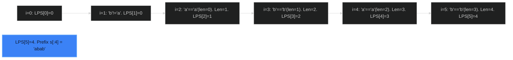

# Longest Happy Prefix 🔴 Hard

**Tags**: `String`, `KMP`, `Rolling Hash`

## Prerequisite Topics

| Topic | Difficulty | Relevance | Notes |
|-------|-----------|-----------|-------|
| KMP Algorithm | 🔴 Hard | **Critical** | LPS Array conceptualization |

## The Challenge

A string is called a **happy prefix** if is a **non-empty** prefix which is also a suffix (excluding itself).
Given a string `s`, return the longest happy prefix of `s`. Return an empty string if no such prefix exists.

**Constraints**:
- $1 \leq s.length \leq 10^5$

**Example**:
```python
Input: s = "level"
Output: "l" (Prefix "l", Suffix "l")
Input: s = "ababab"
Output: "abab" (Prefix "abab", Suffix "abab")
```

## Algorithmic Analysis

### Naive Approach
Check length $N-1$ down to $1$.
- `if s[:k] == s[N-k:]`.
- String slice cost depends on implementation, usually $O(k)$. Total $O(N^2)$.
- **Fail**: TLE.

### Optimal Approach (KMP / LPS Array)
The "Longest Prefix which is also a Suffix" is literally the definition of the LPS array in the Knuth-Morris-Pratt algorithm.
- Calculate LPS array for the whole string.
- `LPS[n-1]` gives the length of the longest proper prefix that is also a suffix.

### Strategic Analysis & Real-World Context

> [!NOTE]
> **Why this matters**: DNA Sequencing (overlapping fragments assembly), Data Compression (LZ77).

## Complexity Analysis

| Dimension | Complexity | Justification |
|-----------|-----------|---------------|
| Time | $O(N)$ | KMP LPS construction. |
| Space | $O(N)$ | LPS array. |

## Visual Walkthrough

`s = "ababab"`



## Solution

```python
def longest_prefix(self, s: str) -> str:
    n = len(s)
    lps = [0] * n
    length = 0
    i = 1
    
    while i < n:
        if s[i] == s[length]:
            length += 1
            lps[i] = length
            i += 1
        else:
            if length != 0:
                length = lps[length - 1]
            else:
                lps[i] = 0
                i += 1
    
    return s[:lps[n - 1]]
```
