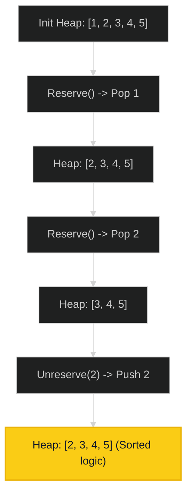

# Seat Reservation Manager 🟡 Medium

**Tags**: `Heap`, `Design`

## Prerequisite Topics

| Topic | Difficulty | Relevance | Notes |
|-------|-----------|-----------|-------|
| Min-Heap | 🟢 Easy | **Critical** | Getting smallest available seat |

## The Challenge

Design a system that manages the reservation state of `n` seats, numbered `1` to `n`.

Implement the `SeatManager` class:
- `SeatManager(int n)` Initializes a `SeatManager` object that will manage `n` seats numbered `1` to `n`. All seats are initially available.
- `int reserve()` Fetches the **smallest-numbered** unreserved seat, reserves it, and returns its number.
- `void unreserve(int seatNumber)` Unreserves the seat with the given `seatNumber`.

**Constraints**:
- $1 \leq n \leq 10^5$
- At most $10^5$ calls to reserve/unreserve.

## Algorithmic Analysis

### Optimal Approach (Min-Heap)
Keep track of *available* seats in a min-heap.
- **Init**: Heap containing `1..n`.
- **Reserve**: Pop min.
- **Unreserve**: Push back seat number.
- **Optimization**: Since initialized sorted, we can use a counter `min_available` and only add logic to heap for *unreserved* seats to save space?
    - **Classic Approach**: Heap everything. Simple.
    - **Optimized**: `min_pointer`. If Heap has items, pop Heap. Else use `min_pointer` and increment. When unreserving, only add to Heap if `seat < min_pointer`. (Not strictly needed given N limit).

### Strategic Analysis & Real-World Context

> [!NOTE]
> **Why this matters**: Movie ticket booking, Resource ID allocation (File descriptors, process IDs).

## Complexity Analysis

| Dimension | Complexity | Justification |
|-----------|-----------|---------------|
| Time | $O(\log N)$ | Heap push/pop. |
| Space | $O(N)$ | Storing available seats. |

## Visual Walkthrough

`N=5`



## Solution

```python
class SeatManager:
    def __init__(self, n: int):
        import heapq
        self.seats = list(range(1, n + 1))
        heapq.heapify(self.seats)

    def reserve(self) -> int:
        import heapq
        return heapq.heappop(self.seats)

    def unreserve(self, seat_number: int) -> None:
        import heapq
        heapq.heappush(self.seats, seat_number)
```
