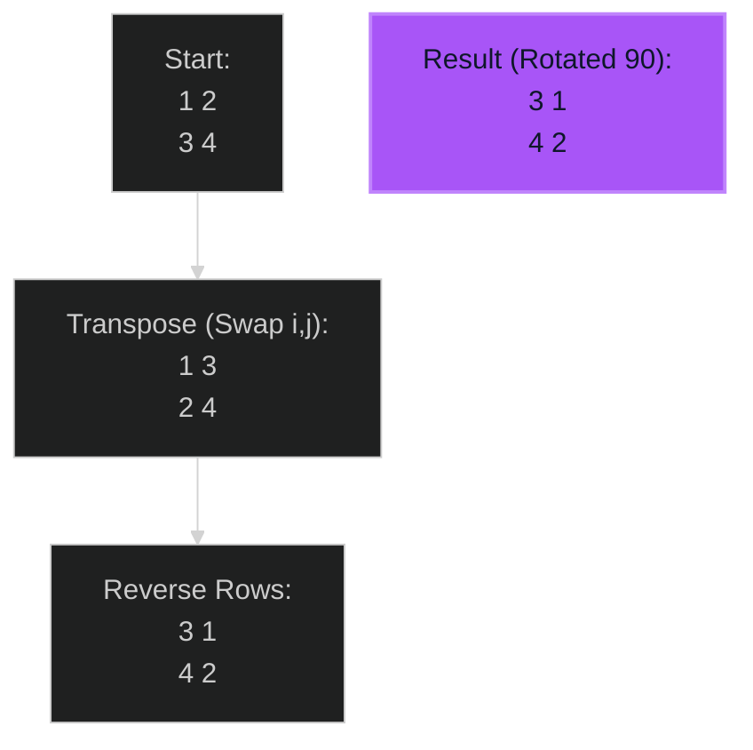

# Rotate Image 🟡 Medium

**Tags**: `Matrix`, `Math`

## Prerequisite Topics

| Topic | Difficulty | Relevance | Notes |
|-------|-----------|-----------|-------|
| Linear Algebra | 🟢 Easy | High | Matrix Transposition |

## The Challenge

You are given an `n x n` 2D matrix representing an image, rotate the image by **90 degrees** (clockwise).
You have to rotate the image **in-place**, which means you have to modify the input 2D matrix directly. DO NOT allocate another 2D matrix and do the rotation.

**Constraints**:
- $1 \leq n \leq 20$

**Example**:
```python
Input: matrix = [[1,2,3],[4,5,6],[7,8,9]]
Output: [[7,4,1],[8,5,2],[9,6,3]]
```

## Algorithmic Analysis

### Optimal Approach (Transpose + Reverse)
Mathematically, rotating 90 deg clockwise is equivalent to:
1. **Transpose**: Flip over main diagonal ($A[i][j] \leftrightarrow A[j][i]$).
2. **Reverse Rows**: $[1, 2, 3] \rightarrow [3, 2, 1]$.

**Example**:
`[1, 2] -> (T) -> [1, 3] -> (Rev) -> [3, 1]`
`[3, 4]           [2, 4]              [4, 2]`
Original `1` at `(0,0)` moves to `(0,1)` (Rev) which is 90 deg?
Wait.
Original:
1 2
3 4

Target 90 (Clockwise):
3 1
4 2

Transpose:
1 3
2 4

Reverse Rows:
3 1
4 2
**Correct**.

### Strategic Analysis & Real-World Context

> [!NOTE]
> **Why this matters**: Image editors (Photo rotation), Graphics rendering pipelines.

## Complexity Analysis

| Dimension | Complexity | Justification |
|-----------|-----------|---------------|
| Time | $O(N^2)$ | Visit every cell twice. |
| Space | $O(1)$ | In-place. |

## Visual Walkthrough

`[[1,2],[3,4]]`



## Solution

```python
def rotate(self, matrix: list[list[int]]) -> None:
    n = len(matrix)
    # 1. Transpose
    for i in range(n):
        for j in range(i, n):
            matrix[i][j], matrix[j][i] = matrix[j][i], matrix[i][j]
            
    # 2. Reverse
    for i in range(n):
        matrix[i].reverse()
```
