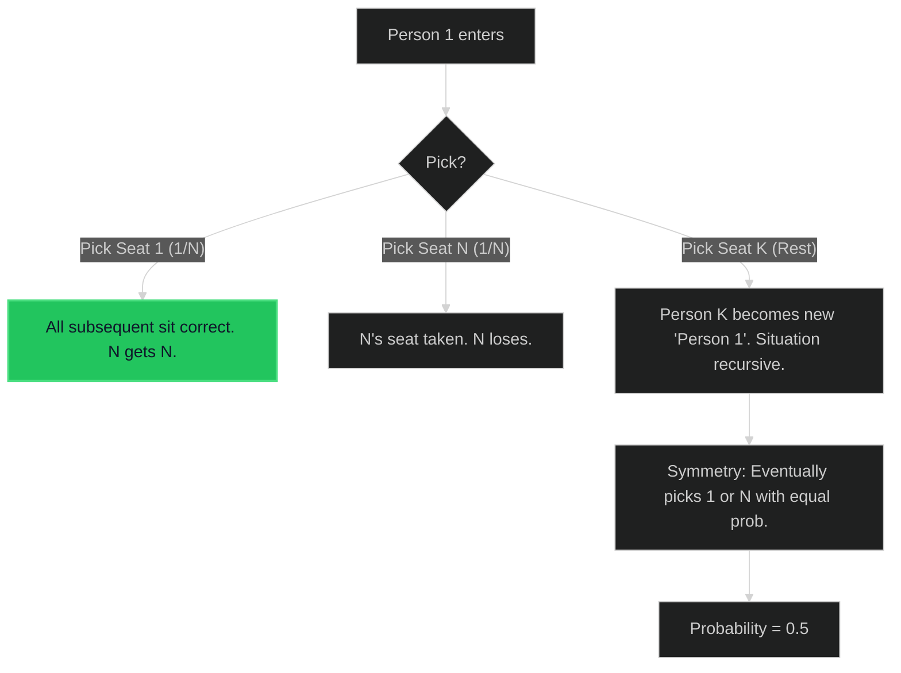

# Airplane Seat Assignment Probability 🟡 Medium

**Tags**: `Math`, `Brainteaser`, `Probability`

## Prerequisite Topics

| Topic | Difficulty | Relevance | Notes |
|-------|-----------|-----------|-------|
| Probability | 🔴 Hard | **Critical** | Inductive reasoning |

## The Challenge

`n` passengers board an airplane with exactly `n` seats. The first passenger has lost the ticket and picks a seat randomly. But after that, the rest of the passengers will:
- Take their own seat if it is still available, 
- Pick other seats randomly when they find their seat occupied.

Return the probability that the `n`-th person gets his own seat.

**Constraints**:
- $1 \leq n \leq 10^5$

**Example**:
```python
Input: n = 2
Output: 0.5
```

## Algorithmic Analysis

### Mathematical Induction
1. **Passenger 1**:
    - Picks seat 1 (Correct): Everyone else sits correct. Nth gets N. Success.
    - Picks seat N (Incorrect): Nth seat taken. Failure.
    - Picks seat K ($1 < k < N$): Passenger K is now displaced. Same problem reduced.
2. **Symmetry**:
    - At any point where a "displaced" person picks a seat, they are equally likely to pick Seat 1 (resolving the chain, everyone remaining is happy including N) or Seat N (dooming N).
    - Therefore, P(Success) = P(Fail) = 0.5.
    - Base case N=1: P=1.0.

### Strategic Analysis & Real-World Context

> [!NOTE]
> **Why this matters**: Interview favorite for testing intuition over brute force simulation.

## Complexity Analysis

| Dimension | Complexity | Justification |
|-----------|-----------|---------------|
| Time | $O(1)$ | Constant logic. |
| Space | $O(1)$ | No storage. |

## Visual Walkthrough

`N=3`



## Solution

```python
def nth_person_gets_nth_seat(self, n: int) -> float:
    return 1.0 if n == 1 else 0.5
```
