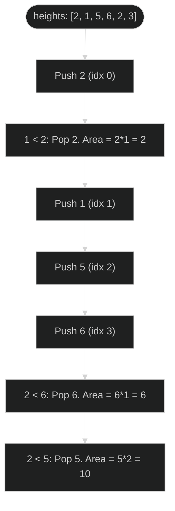

# Largest Rectangle in Histogram 🔴 Hard

**Tags**: `Stack`, `Array`

## Prerequisite Topics

| Topic | Difficulty | Relevance | Notes |
|-------|-----------|-----------|-------|
| Monotonic Stack | 🔴 Hard | **Critical** | Efficiently finding boundaries |

## The Challenge

Given an array of integers `heights` representing the histogram's bar height where the width of each bar is 1, return the area of the largest rectangle in the histogram.

**Constraints**:
- $1 \leq heights.length \leq 10^5$
- $0 \leq heights[i] \leq 10^4$

**Example**:
```python
Input: heights = [2,1,5,6,2,3]
Output: 10
Explanation: The bars 5 and 6 form a rectangle of height 5 and width 2.
```

## Algorithmic Analysis

### Optimal Approach (Monotonic Stack)
We use a stack to keep track of indices of bars in increasing order of height.
- **Logic**: For each bar, if it's shorter than the bar at the stack top, we've found the right boundary for the bar at the top. The left boundary is the index below it in the stack.
- **Complexity**: Each index is pushed and popped once.

## Complexity Analysis

| Dimension | Complexity | Justification |
|-----------|-----------|---------------|
| Time | $O(N)$ | Single pass with stack operations. |
| Space | $O(N)$ | Stack depth. |

## Visual Walkthrough



## Solution

```python
def largest_rectangle_area(self, heights: list[int]) -> int:
    stack = [-1]
    max_area = 0
    for i, h in enumerate(heights):
        while stack[-1] != -1 and heights[stack[-1]] >= h:
            curr_h = heights[stack.pop()]
            curr_w = i - stack[-1] - 1
            max_area = max(max_area, curr_h * curr_w)
        stack.append(i)
    while stack[-1] != -1:
        curr_h = heights[stack.pop()]
        curr_w = len(heights) - stack[-1] - 1
        max_area = max(max_area, curr_h * curr_w)
    return max_area
```
