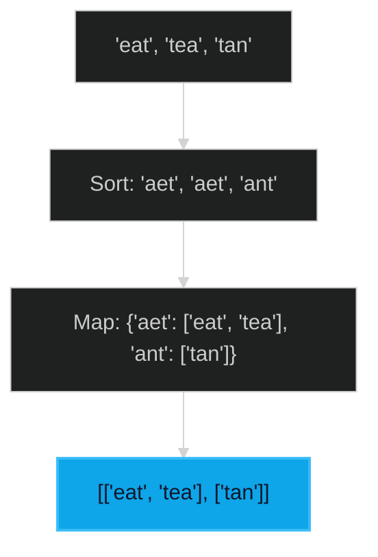

# Group Anagrams 🟡 Medium

**Tags**: `Array`, `Hash Map`, `String`

## Prerequisite Topics

| Topic | Difficulty | Relevance | Notes |
|-------|-----------|-----------|-------|
| Hash Maps | 🟢 Easy | **Critical** | Tracking groups |
| Sorting | 🟢 Easy | High | Generating unique keys |

## The Challenge

Given an array of strings `strs`, group the anagrams together. You can return the answer in any order.

**Constraints**:
- $1 \leq strs.length \leq 10^4$
- $0 \leq strs[i].length \leq 100$

**Example**:
```python
Input: strs = ["eat","tea","tan","ate","nat","bat"]
Output: [["bat"],["nat","tan"],["ate","eat","tea"]]
```

## Algorithmic Analysis

### Optimal Approach (Sorting as Key)
Iterate through the strings. For each string:
1. Sort its characters to create a unique key (e.g., "eat" -> "aet").
2. Store the original string in a hash map under this key.

## Complexity Analysis

| Dimension | Complexity | Justification |
|-----------|-----------|---------------|
| Time | $O(N \cdot K \log K)$ | Sorting $N$ strings of length $K$. |
| Space | $O(N \cdot K)$ | Storage for result. |

## Visual Walkthrough



## Solution

```python
def group_anagrams(self, strs: list[str]) -> list[list[str]]:
    groups = {}
    for s in strs:
        key = "".join(sorted(s))
        groups.setdefault(key, []).append(s)
    return list(groups.values())
```
