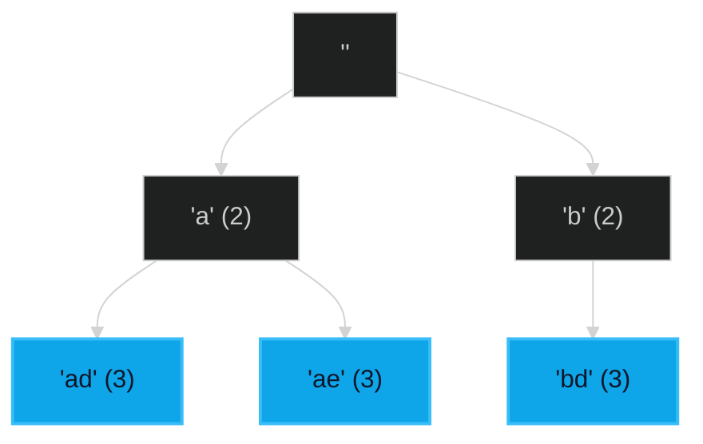

# Letter Combinations of a Phone Number 🟡 Medium

**Tags**: `Backtracking`, `Hash Map`, `String`

## Prerequisite Topics

| Topic | Difficulty | Relevance | Notes |
|-------|-----------|-----------|-------|
| Recursion (Backtracking) | 🟡 Medium | **Critical** | Exploring all combinations |

## The Challenge

Given a string containing digits from 2-9 inclusive, return all possible letter combinations that the number could represent.

**Constraints**:
- $0 \leq digits.length \leq 4$
- `digits[i]` is a digit in the range ['2', '9'].

**Example**:
```python
Input: digits = "23"
Output: ["ad","ae","af","bd","be","bf","cd","ce","cf"]
```

## Algorithmic Analysis

### Optimal Approach (Backtracking)
Use a map to relate digits to letters. Use recursion to build combinations.
- **Base Case**: If current combination length == digits length, add to results.
- **Recursive Step**: Pick a letter for the current digit, then recurse for the next digit.

## Complexity Analysis

| Dimension | Complexity | Justification |
|-----------|-----------|---------------|
| Time | $O(4^N)$ | $N$ is number of digits. Max 4 letters per digit. |
| Space | $O(N)$ | Recursion depth. |

## Visual Walkthrough



## Solution

```python
def letter_combinations(self, digits: str) -> list[str]:
    if not digits: return []
    digit_map = {"2":"abc","3":"def","4":"ghi","5":"jkl","6":"mno","7":"pqrs","8":"tuv","9":"wxyz"}
    res = []
    def backtrack(index, path):
        if index == len(digits):
            res.append("".join(path))
            return
        for char in digit_map[digits[index]]:
            path.append(char)
            backtrack(index+1, path)
            path.pop()
    backtrack(0, [])
    return res
```
