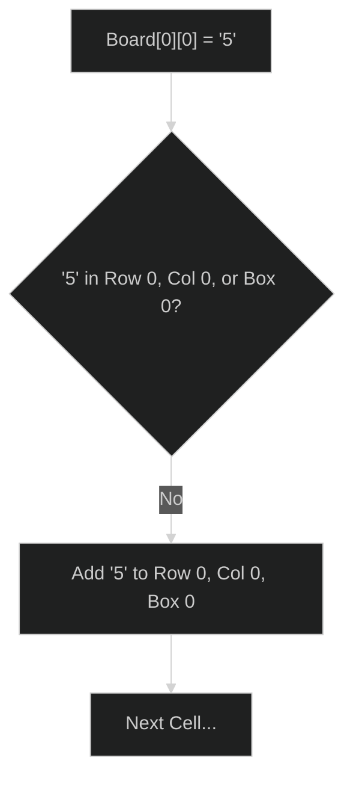

# Valid Sudoku 🟡 Medium

**Tags**: `Array`, `Hash Table`, `Matrix`

## Prerequisite Topics

| Topic | Difficulty | Relevance | Notes |
|-------|-----------|-----------|-------|
| Hash Sets | 🟢 Easy | **Critical** | Duplicate detection |

## The Challenge

Determine if a 9x9 Sudoku board is valid. Only the filled cells need to be validated.

**Example**:
```python
Input:
[["5","3",".",".","7",".",".",".","."]
,["6",".",".","1","9","5",".",".","."]
,...]
Output: True
```

## Algorithmic Analysis

### Optimal Approach (One Pass with Sets)
Use 3 lists of 9 sets each to track digits seen in each row, column, and 3x3 box.
- **Logic**: For each cell `(r, c)` with digit `v`, check if `v` exists in `row[r]`, `col[c]`, or `box[idx]`.
- **Box Index**: `(r // 3) * 3 + (c // 3)`.

## Complexity Analysis

| Dimension | Complexity | Justification |
|-----------|-----------|---------------|
| Time | $O(1)$ | Board size is fixed at 9x9. |
| Space | $O(1)$ | Fixed storage required. |

## Visual Walkthrough



## Solution

```python
def is_valid_sudoku(self, board: list[list[str]]) -> bool:
    rows = [set() for _ in range(9)]; cols = [set() for _ in range(9)]; boxes = [set() for _ in range(9)]
    for r in range(9):
        for c in range(9):
            val = board[r][c]
            if val == ".": continue
            idx = (r // 3) * 3 + (c // 3)
            if val in rows[r] or val in cols[c] or val in boxes[idx]: return False
            rows[r].add(val); cols[c].add(val); boxes[idx].add(val)
    return True
```
