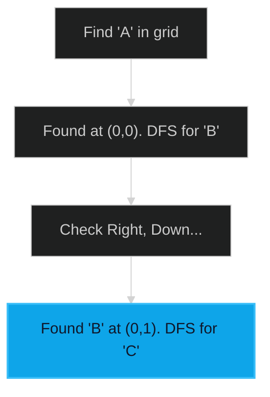

# Word Search 🟡 Medium

**Tags**: `Array`, `Backtracking`, `Matrix`

## Prerequisite Topics

| Topic | Difficulty | Relevance | Notes |
|-------|-----------|-----------|-------|
| Depth First Search (DFS) | 🟡 Medium | **Critical** | Exploring grid paths |

## The Challenge

Given an `m x n` grid of characters `board` and a string `word`, return `true` if `word` exists in the grid.

**Constraints**:
- $1 \leq m, n \leq 6$
- $1 \leq word.length \leq 15$

## Algorithmic Analysis

### Optimal Approach (Backtracking/DFS)
Iterate through every cell. If the cell matches the first letter of `word`, start a DFS.
- **Logic**: Move in 4 directions. Mark current cell as visited (e.g., using `#`) to avoid re-using it in the same path. Backtrack by restoring the character after recursion.

## Complexity Analysis

| Dimension | Complexity | Justification |
|-----------|-----------|---------------|
| Time | $O(N \cdot M \cdot 4^L)$ | $L$ is word length. |
| Space | $O(L)$ | Recursion depth. |

## Visual Walkthrough



## Solution

```python
def word_search(self, board: list[list[str]], word: str) -> bool:
    rows, cols = len(board), len(board[0])
    def dfs(r, c, k):
        if k == len(word): return True
        if r<0 or r>=rows or c<0 or c>=cols or board[r][c]!=word[k]: return False
        temp = board[r][c]; board[r][c] = "#"
        res = dfs(r+1,c,k+1) or dfs(r-1,c,k+1) or dfs(r,c+1,k+1) or dfs(r,c-1,k+1)
        board[r][c] = temp
        return res
    for r in range(rows):
        for c in range(cols):
            if dfs(r, c, 0): return True
    return False
```
