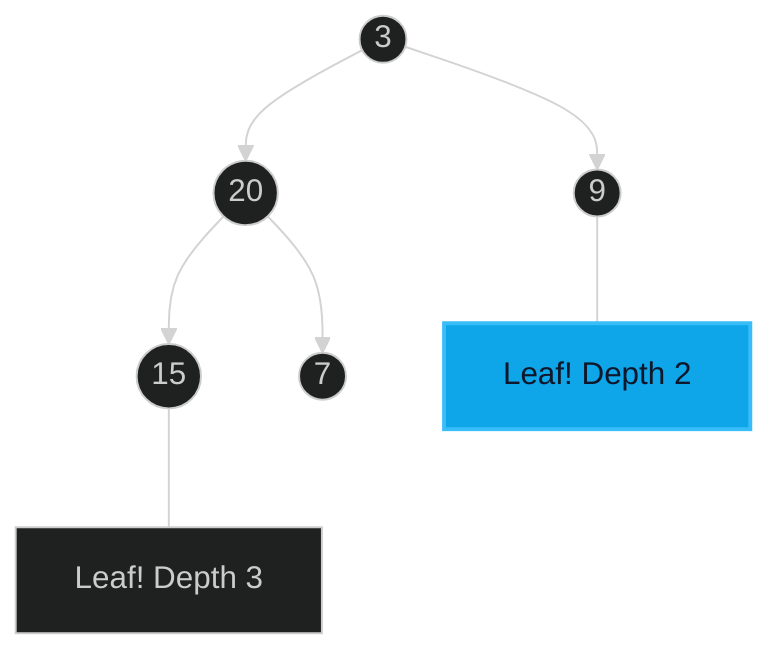

# Minimum Depth of Binary Tree 🟢 Easy

**Tags**: `Tree`, `DFS`, `BFS`

## Prerequisite Topics

| Topic | Difficulty | Relevance | Notes |
|-------|-----------|-----------|-------|
| Tree Traversal | 🟢 Easy | **Critical** | DFS/BFS foundations |

## The Challenge

Find the minimum depth of a binary tree. The minimum depth is the number of nodes along the shortest path from the root node down to the nearest leaf node.

**Constraints**:
- The number of nodes in the tree is in the range $[0, 10^5]$.
- $-1000 \leq Node.val \leq 1000$

## Algorithmic Analysis

### Optimal Approach (DFS)
Calculate the depth of left and right subtrees.
- **Edge Case**: If one child is missing, the depth is determined by the other child (not zero, as a leaf must have no children).
- **Recurrence**: `1 + min(depth(left), depth(right))` if both exist.

## Complexity Analysis

| Dimension | Complexity | Justification |
|-----------|-----------|---------------|
| Time | $O(N)$ | Visit each node once. |
| Space | $O(H)$ | $H$ is tree height (stack space). |

## Visual Walkthrough



## Solution

```python
def min_depth(self, root: TreeNode | None) -> int:
    if not root: return 0
    if not root.left: return self.min_depth(root.right) + 1
    if not root.right: return self.min_depth(root.left) + 1
    return min(self.min_depth(root.left), self.min_depth(root.right)) + 1
```
